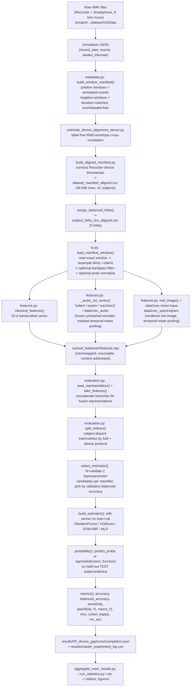
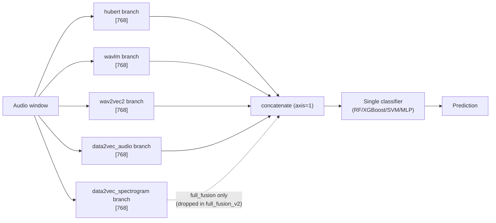
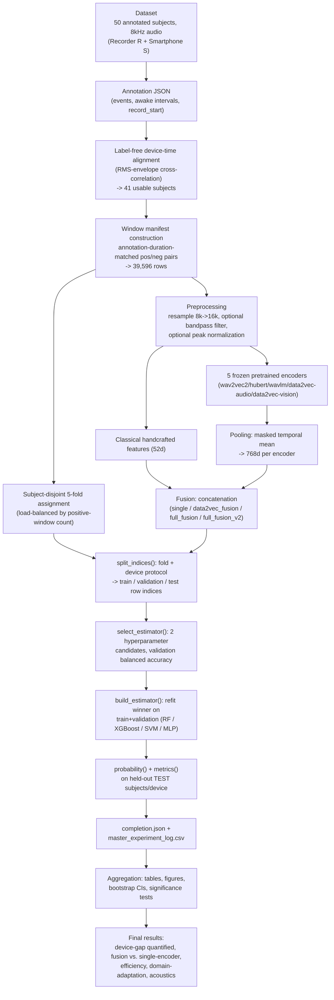

# Codebase Architecture & Experiment Learning Guide

**Project:** Sleep-QuadNet — cross-device (clinical Recorder **R** vs. Smartphone **S**) respiratory-event (apnea/hypopnea) detection from audio, for the IEEE HealthCom 2026 workshop.

This document is a from-scratch, code-verified explanation of the entire experiment: what runs, in what order, on what data, producing what numbers. Every claim is traceable to a specific file and line range from the three parallel inspection passes performed to write this guide, or is explicitly marked as background knowledge / interpretation. Nothing here was invented — where the code doesn't say, this document says so.

> **How to read this document.** It is long by design — it is meant to be read in pieces, and re-opened as a reference. Step 43 (Glossary) and Step 47 (Researcher Questions) are the fastest way back in if you lose your place.

---

## Table of Contents

1. [Project Tree](#1-project-tree)
2. [The True Entry Point & Call Sequence](#2-the-true-entry-point--call-sequence)
3. [End-to-End Flowchart](#3-end-to-end-flowchart)
4. [The Dataset](#4-the-dataset)
5. [Journey of One Sample](#5-journey-of-one-sample-through-the-entire-system)
6. [Data Splitting](#6-data-splitting)
7. [Preprocessing](#7-preprocessing)
8. [Representation](#8-representation-raw-signal-vs-feature-vs-embedding)
9. [The Models](#9-the-models)
10. [Pretrained Model Details](#10-pretrained-model-details)
11. [Model Architecture Diagram](#11-model-architecture-diagram)
12. [Model Layers Explained](#12-model-layers-explained)
13. [Trainable vs. Frozen Parameters](#13-trainable-vs-frozen-parameters)
14. [The Classifiers](#14-the-classifiers)
15. [Why This Representation + This Classifier?](#15-why-are-we-combining-this-representation-with-this-classifier)
16. [Feature Pooling](#16-feature-pooling)
17. [Multi-Modal / Multi-Encoder Fusion](#17-multi-encoder-fusion)
18. [The "Training Loop"](#18-the-training-loop)
19. [Forward Pass and Backpropagation](#19-forward-pass-and-backpropagation)
20. [Loss Function](#20-loss-function)
21. [Optimizer](#21-optimizer)
22. [Learning Rate](#22-learning-rate)
23. [Batch Size](#23-batch-size)
24. [Epoch](#24-epoch)
25. [Data Loader](#25-data-loader)
26. [GPU Flow](#26-gpu-flow)
27. [Python Programming Constructs Used](#27-python-programming-constructs-used-in-this-project)
28. [Critical Code Walkthrough](#28-critical-code-walkthrough-2050-blocks)
29. [Shape Tracking Table](#29-shape-tracking-table)
30. [Experiments Table](#30-experiments)
31. [Baseline vs. Proposed Method](#31-baseline-vs-proposed-method)
32. [Hyperparameter Table](#32-hyperparameter-table)
33. [Metrics](#33-metrics)
34. [Confusion Matrix](#34-confusion-matrix)
35. [Checkpointing](#35-checkpointing)
36. [Early Stopping](#36-early-stopping)
37. [Random Seed & Reproducibility](#37-random-seed--reproducibility)
38. [Class Imbalance](#38-class-imbalance)
39. [Data Augmentation](#39-data-augmentation)
40. [Data Leakage Audit](#40-data-leakage-audit)
41. [Research Methodology Audit](#41-research-methodology-audit)
42. [Code vs. Research Concept Mapping](#42-code-vs-research-concept-mapping)
43. [Beginner's Dictionary](#43-beginners-dictionary)
44. [What Exactly Happens When I Press Run?](#44-what-exactly-happens-when-i-press-run)
45. [One Clip Under the Microscope](#45-one-clip-under-the-microscope-feature-extraction)
46. [One Prediction Under the Microscope](#46-one-prediction-under-the-microscope-inference)
47. [Researcher Questions](#47-researcher-questions-answered)
48. [Interview Preparation](#48-interview-preparation)
49. [Supervisor / Viva Preparation](#49-supervisor--viva-preparation)
50. [Final Master Diagram](#50-final-master-diagram)
51. [Mental Model Summary](#51-mental-model-summary)
52. [Source-of-Truth Table](#52-source-of-truth-table)

---

## 1. Project Tree

```text
IEEE_healthcomm_workshop/                  (= /home/pkdas/IEEE_healthcomm_workshop, symlink target)
│
├── configs/
│   ├── base.yaml                          # THE single source of truth: paths, seed, folds,
│   │                                       #   windowing rules, audio params, spectrogram params,
│   │                                       #   encoder model IDs, classifier hyperparameter grids,
│   │                                       #   protocols, representations (incl. full_fusion_v2)
│   └── experiments/workshop_strategy.yaml # Per-phase experiment scope (P0-A..D, P1-A..D)
│
├── metadata/                               # Small, code-generated CSV/JSON (NOT raw audio)
│   ├── dataset_manifest.csv               # Pre-alignment window manifest
│   ├── dataset_manifest_aligned.csv       # ** THE manifest actually used by every experiment **
│   ├── subject_folds_5cv_aligned.csv      # subject_id -> fold (0-4) assignment
│   ├── fold_protocols_5cv_aligned.csv     # per-outer-fold train/val/test subject lists
│   ├── device_alignment_dense_anchors.csv # per-subject RMS-envelope cross-correlation anchors
│   └── aligned_metadata_validation.json   # leakage/pairing self-check written by the builder
│
├── src/sleep_quadnet/                      # THE package — everything imports from here
│   ├── io.py                              # low-level: WAV reading, resampling, filtering,
│   │                                       #   peak-norm, config hashing, locked CSV append
│   ├── metadata.py                        # window construction (positive/negative pairing),
│   │                                       #   fold assignment, leakage validation
│   ├── features.py                        # pretrained-encoder loading + feature-cache extraction
│   ├── evaluation.py                      # THE core: splits, classifiers, metrics, run_fold()
│   └── advanced.py                        # PCA dimension-control and CORAL domain-adaptation
│
├── scripts/                                # CLI entry points (one script = one experiment action)
│   ├── build_metadata.py, build_aligned_manifest.py     # data pipeline construction
│   ├── estimate_device_alignment.py / _dense.py         # device clock-offset estimation
│   ├── validate_windows.py, validate_splits.py          # independent leakage/pairing audits
│   ├── extract_features.py                              # runs one encoder's feature cache
│   ├── run_main_benchmark.py              # ** THE main experiment driver (P0-A) **
│   ├── run_dimension_control.py           # PCA dimension-control driver (P1-C)
│   ├── run_coral.py                       # CORAL domain-adaptation driver (P1-D)
│   ├── select_ablation_top3.py, run_ablation_top3_task.py  # two-stage ablation (P0-B)
│   ├── run_statistics.py                  # bootstrap CIs / significance tests (P0-C)
│   ├── benchmark_efficiency.py, benchmark_fusion_efficiency.py  # latency/memory (P0-D)
│   ├── analyze_device_acoustics.py        # recorder-vs-phone acoustic characterization (P1-A)
│   ├── aggregate_main_results.py, aggregate_ablation.py, aggregate_efficiency.py,
│   │   finalize_secondary_results.py, generate_experiment_summary.py   # results -> tables/figures
│   └── show_progress.py                   # live completion-count dashboard
│
├── slurm/                                  # 30+ SLURM job scripts (one per experiment phase/wave)
├── cached_features/  → /scratch/...        # symlink: extracted embeddings (see §35)
├── checkpoints/       → /scratch/...       # symlink: fitted classifier binaries (see §35)
├── .venv/             → /scratch/...       # symlink: Python environment (see §35)
├── results/                                 # every experiment's actual output
│   ├── master_experiment_log.csv          # append-only row-per-run registry (ALL phases)
│   ├── P0_device_gap/runs/<run_id>/       # completion.json, window_predictions.csv.gz, ...
│   ├── P0_ablation/, P0_statistics/, P0_efficiency/
│   ├── P1_device_acoustics/, P1_preprocessing/, P1_dimension_control/, P1_domain_adaptation/
│   └── tables/, audit/
├── figures/                                 # publication PDFs
├── logs/                                    # SLURM stdout/stderr
├── Sleep_QuadNet_Workshop_Experiment_Plan.md  # the authoritative research plan (RQs, phases)
├── GPU_INSTRUCTIONS.md                    # cluster operating rules
└── README_REPRODUCIBLE_PIPELINE.md
```

Everything under `metadata/`, `results/`, `configs/`, `src/`, `scripts/`, `slurm/` is project-authored. `cached_features/`, `checkpoints/`, `.venv/` are large and physically live on `/scratch` (symlinked into place — see §35); they are *not* source code, they are generated/tooling artifacts.

---

## 2. The True Entry Point & Call Sequence

There is no single `python main.py`. The experiment is a **grid of independent CLI invocations**, one per SLURM job, each calling one script. The one that matters most is `run_main_benchmark.py` — it is the command that actually produces the primary results table.

```bash
# The command that runs the core experiment (one representation/classifier/protocol/fold combo,
# or many at once):
.venv/bin/python scripts/run_main_benchmark.py \
  --representations hubert,wavlm --classifiers svm_rbf,mlp \
  --protocols R_R,S_S,R_S,S_R --folds 0,1,2,3,4 --workers 4

# launched via SLURM, e.g.:
sbatch slurm/04p_main_individual_ready.sbatch
```

Call sequence for that command (file:function, in order — `scripts/run_main_benchmark.py:1-110`):

```text
run_main_benchmark.py:main()
   │
   ├─ load_yaml(configs/base.yaml)                       [io.py:18]
   ├─ iter_grid(config, reps, classifiers, protocols, folds)   [evaluation.py:440]
   │     yields every (representation, classifier, protocol, fold) 4-tuple
   │
   └─ for each tuple  →  evaluation.run_fold(...)          [evaluation.py:280]
         │
         ├─ config_hash(...) → experiment_key              [io.py:39]
         ├─ _completed_key(): already done? → skip          [evaluation.py:258]
         ├─ read_csv_rows(manifest)                          [io.py:26]
         ├─ parse_folds(fold_file)                           [evaluation.py:46]
         ├─ split_indices(rows, folds, fold, protocol)        [evaluation.py:67]
         ├─ load_representation(cache_root, representation)   [evaluation.py:150]
         ├─ (fit-cache miss) select_estimator(...)             [evaluation.py:227]
         │     └─ build_estimator(...) x2 candidates            [evaluation.py:180]
         ├─ build_estimator(...) final refit on train+val
         ├─ probability(estimator, x_test)                    [evaluation.py:197]
         ├─ metrics(labels, probabilities)                    [evaluation.py:204]
         ├─ write window_predictions.csv.gz, subject_metrics.csv, classifier_ref.json,
         │     completion.json
         └─ append_csv(...) → results/master_experiment_log.csv   [io.py:148]
```

If instead you run `run_dimension_control.py` or `run_coral.py`, the same `split_indices`/`select_estimator`/`build_estimator`/`metrics` building blocks are reused, but the orchestration is `advanced.py:run_pca_fold` / `advanced.py:run_coral_fold` (see §9, §18, §41).

---

## 3. End-to-End Flowchart



---

## 4. The Dataset

| Fact | Value | Source |
|---|---|---|
| Domain | Sleep-audio respiratory-event (apnea/hypopnea) detection | Experiment plan |
| Modality | **Audio only** — no ECG/PPG/SpO2/airflow/thorax channels are read anywhere in the code | Confirmed: no such loaders exist in `io.py`/`metadata.py`/`features.py` |
| Devices | Two, paired per subject: **R** = clinical bedside Recorder, **S** = Smartphone | `metadata.py`, manifest `device` column |
| Raw sampling rate | 8000 Hz (all WAVs, mono, 16-bit PCM) | `metadata.py:_window_row` line 216 (literal); `wav_info()` enforces mono+16-bit |
| Target sampling rate | 16000 Hz (resampled) | `metadata.py:_window_row` line 217 (literal); `io.py:resample_polyphase` |
| Annotation subjects | 50 | `generate_experiment_summary.py:105` (stated fact, sourced from the original audit) |
| Subjects with both device recordings | 43 | same |
| Subjects with reliable device-time alignment (**actually used**) | **41** — confirmed directly: `dataset_manifest_aligned.csv` has exactly 41 unique `subject_id` values | Direct count |
| Manifest rows (windows) | **39,596** (`wc -l` = 39,597 incl. header) | Direct count |
| Rows by device | R: 19,798 · S: 19,798 (exactly balanced — every window exists for both devices) | Direct count |
| Label balance | label=1 (event): **19,870** · label=0 (normal): **19,726** — 50.2% / 49.8%, i.e. **near-perfectly balanced** | Direct count |
| Event-type breakdown | `hypo`: 13,486 · `osa`: 6,384 · `normal`: 19,726 (`hypo+osa = 19,870 = label=1` exactly) | Direct count |
| Label definition | `label=1` ⟺ window == an annotated event interval `[evnet_start, evnet_start+event_duration)` from that subject's raw annotation JSON, for **any** `event_type` (hypo/osa, not filtered) and **any** sleep stage by default (`exclude_wake_events: false` in config). `label=0` ⟺ a synthetic negative window of the *same duration as its paired positive*, drawn from time not overlapping any event or awake interval. | `metadata.py:build_window_manifest` lines 222-325 |
| Window duration | **Not fixed** — every window's length equals its paired event's `event_duration` (positives) or the matched-duration draw (negatives); annotation data shows event durations ranging ~0.9-126.0 s (median ~21.9 s) | `metadata.py` design (`windowing.mode: annotation_duration_matched_negative`); duration stats from the earlier project audit |
| Overlap between windows | Negatives are constructed to avoid overlapping events, awake intervals, and (by default) each other; `avoid_negative_overlap: true` in config, with a documented fallback that relaxes the last constraint if no valid slot is found (`negative_overlap_fallback` flag in manifest) | `metadata.py:choose_interval`, `build_window_manifest` lines 270-272 |
| Filtering / normalization applied before feature extraction | Resampling (always) → optional 4th-order Butterworth bandpass 20–4000 Hz (zero-phase) → optional peak normalization, depending on the `preprocessing` variant requested (`raw`/`peak`/`filter`/`peak_filter`) | `io.py:load_manifest_window` |
| Device-time alignment method | **Label-free**: RMS-envelope (0.1 s frames, log + z-scored) cross-correlation between Recorder and Smartphone audio, piecewise-linear interpolation of the resulting lag across "reliable" anchor segments (correlation ≥ 0.45, not at search-window boundary) | `estimate_device_alignment_dense.py` |
| Subjects excluded from the aligned manifest, and why | Any of the 43 paired subjects with fewer than 3 reliable alignment anchors, or median anchor correlation < 0.5, are excluded entirely; individual windows falling outside any reliable alignment segment are excluded even for included subjects | `build_aligned_manifest.py` lines 34-37, 46-59 |
| Missing-data handling | Not "handled" via imputation — windows/subjects that don't meet coverage or alignment-reliability criteria are **excluded**, not imputed | `metadata.py`, `build_aligned_manifest.py` |
| Metadata usage | `subject_id`, `device`, `label`, `event_type`, `sleep_stage`, timing columns are all used directly for splitting/labeling; free-text fields like `audio_paths_json` are provenance only | manifest schema |

**Exact `dataset_manifest_aligned.csv` schema (20 columns):**
`sample_id, logical_window_id, subject_id, device, label, event_type, sleep_stage, start_sec, end_sec, duration_sec, paired_positive_id, audio_paths_json, audio_segment_durations_json, raw_sample_rate, target_sample_rate, negative_overlap_fallback, reference_start_sec, reference_end_sec, device_time_offset_start_sec, device_time_offset_end_sec`

Every `logical_window_id` has **exactly 2 rows** (one `device=R`, one `device=S`) — this pairing is validated by `metadata.py:validate_metadata` and independently re-validated by `scripts/validate_windows.py`, which re-derives everything from the raw annotation JSON files rather than trusting the manifest-building code path.

---

## 5. Journey of One Sample Through the Entire System

Concrete trace for one hypothetical positive window, representation = `hubert` (single encoder), classifier = `svm_rbf`. Dimensions shown are exact where the code fixes them, and representative where they legitimately vary (audio window length varies per event).

```text
1. Raw window selection
   Manifest row: sample_id="058ee4e7d7c81cd0_R", device=R, label=1,
                 start_sec=9696.24, end_sec=9720.35  (duration ≈ 24.1 s)
   ↓
2. io.py:_read_native_window()
   Reads the exact [start_sec, end_sec) span from the subject's WAV file(s)
   shape: [n_samples] where n_samples ≈ 24.1 s x 8000 Hz ≈ 192,835   (varies per window)
   dtype: float32, mono
   ↓
3. io.py:resample_polyphase()  (scipy.signal.resample_poly, up=2, down=1 for 8k->16k)
   shape: [n_samples_16k] ≈ 24.1 s x 16000 Hz ≈ 385,670
   ↓
4. (optional) io.py:butter_bandpass()   -- only if preprocessing in {filter, peak_filter}
   shape unchanged; zero-phase 4th-order Butterworth, 20-4000 Hz
   ↓
5. (optional) peak normalization        -- only if preprocessing in {peak, peak_filter}
   audio = audio / max(|audio|)   (shape unchanged)
   ↓
6. features.py:_audio_ssl_vector()
   Chunked into <=20 s pieces (ssl_max_chunk_seconds): here, 1 chunk of ~385,670 samples
   (since 24.1 s < 20 s?  NO -- 24.1s > 20s, so this window is split into 2 chunks:
    one ~20s chunk (320,000 samples) + one ~4.1s remainder chunk (65,670 samples))
   Each chunk -> AutoFeatureExtractor (facebook/hubert-base-ls960)
            -> input_values tensor, shape [1, chunk_n_samples]
   ↓
7. HubertModel.forward()  (frozen, torch.inference_mode(), fp16 autocast on CUDA)
   last_hidden_state shape: [1, T, 768]   where T ~= chunk_n_samples / 320 (model's ~20ms stride)
     e.g. chunk 1 (20s):    T ~ 999   -> [1, 999, 768]
          chunk 2 (4.1s):   T ~ 205   -> [1, 205, 768]
   ↓
8. features.py:masked_temporal_mean() applied per chunk -> [1, 768] per chunk
   then WEIGHTED mean across the two chunks, weight = each chunk's T (frame count)
   ↓
   Final feature vector: shape [768], dtype float32 (cast back to CPU/float32)
   ↓
9. Cached to cached_features/hubert/peak/features.npy[row_index] -- shape [768] slot
   ↓
10. evaluation.py:take_features(arrays, test_idx)
    Single-encoder representation -> shape [n_test_windows, 768]  (batched here, not per-sample)
    ↓
11. evaluation.py:probability(estimator, x_test)
    SVC (inside a StandardScaler pipeline), predict_proba -> [n_test_windows, 2]
    -> column 1 taken -> [n_test_windows]  (one probability per window)
    ↓
12. metrics(): probabilities >= 0.5 -> predicted label (0 or 1) for our one window
    ↓
13. Written to window_predictions.csv.gz:
    {run_id, sample_id, subject_id, device, label=1 (true), probability=0.71, prediction=1}
```

**Important clarification on "batch size":** feature *extraction* (steps 6-9) processes one window (and, within it, one 20-second chunk) through the encoder at a time — there is no multi-window batching there (`_audio_ssl_vector` calls the processor with `[chunk]`, a length-1 list). *Classifier* fitting/inference (steps 10-13), by contrast, operates on the **entire** train/val/test array at once — hundreds to tens of thousands of windows in a single `estimator.fit(...)` / `estimator.predict_proba(...)` call. These are two entirely different computational regimes; see §23.

---

## 6. Data Splitting

**Method: fixed subject-disjoint 5-fold cross-validation, with a device-protocol axis layered on top.**

- `metadata.py:assign_balanced_folds` assigns each of the 41 usable subjects to exactly one of 5 folds (0-4), via a greedy load-balancing heuristic on each subject's positive-window count (sorted descending, each subject placed into whichever fold currently has the lowest total positive-window load). Result (`subject_folds_5cv_aligned.csv`): fold sizes **9, 8, 8, 8, 8** subjects.
- For a chosen `fold` (0-4): **test subjects** = subjects assigned to that fold. **Validation subjects** = subjects assigned to fold `(fold+1) % 5`. **Train subjects** = the remaining 3 folds. (`evaluation.py:split_indices`, lines 67-96 — confirmed exactly.)
- The **same subject-to-fold assignment is used for both devices** — a subject in the test fold is a test subject regardless of whether you're evaluating on their R or S recordings.
- **Device protocol** (`R_R`, `S_S`, `R_S`, `S_R`, `RS_RS`) then filters *which device's rows* are pulled from the train/val/test subject sets (`evaluation.py:protocol_devices`, lines 54-64):

  | Protocol | Train device | Test device |
  |---|---|---|
  | `R_R` | R | R |
  | `S_S` | S | S |
  | `R_S` | R | S |
  | `S_R` | S | R |
  | `RS_RS` | R+S | R+S |

  Validation rows are always drawn using the **train** device set (i.e. validation never sees the test device — this matters for cross-device protocols: for `R_S`, both train and validation use device R; only the final test set is device S).

**Example (fold=0, protocol=R_S):** test subjects = fold-0's 9 subjects, evaluated on their **S** recordings. Validation subjects = fold-1's 8 subjects, evaluated on their **R** recordings. Train subjects = the other 24 subjects (folds 2,3,4), on their **R** recordings.

**Explicit leakage guard in code** (`evaluation.py` lines 91-92):
```python
if train_subjects & val_subjects or train_subjects & test_subjects or val_subjects & test_subjects:
    raise AssertionError("Subject leakage in split construction")
```

### Can the same patient enter both training and testing?

**No — by construction, and doubly enforced.** A subject belongs to exactly one fold; the fold determines the subject's role (train/val/test) for every protocol. The assertion above is a hard runtime check, and a second, entirely independent audit (`metadata.py:validate_metadata`, run by `scripts/validate_splits.py`) re-derives train/val/test subject sets from the fold file and manifest and checks the same disjointness property from scratch, separately from `split_indices` itself.

---

## 7. Preprocessing

| Operation | Where | Why | Input → Output shape | If skipped |
|---|---|---|---|---|
| **Exact-window read** | `io.py:_read_native_window` | Extract only the annotated/matched time span, not the whole recording | file → `[n_samples_8k]` | Can't isolate the event |
| **Resampling** (8kHz→16kHz, polyphase FIR) | `io.py:resample_polyphase` | All 5 pretrained SSL/vision encoders expect 16 kHz input; raw recordings are 8 kHz | `[n]` → `[2n]` (exact 2x here since `gcd(8000,16000)=8000`) | Encoders would receive audio at the wrong effective pitch/rate — meaningless features |
| **Bandpass filter** (20-4000 Hz, order-4 Butterworth, zero-phase) — *only* for `filter`/`peak_filter` variants | `io.py:butter_bandpass` | Removes sub-20Hz drift and content above 4kHz (outside the clinically-relevant respiratory-sound band; also near/above the 4kHz Nyquist of the *original* 8kHz recording, so filtering here is conservative) | shape unchanged | Retains out-of-band noise; classical MFCC/spectral features become noisier |
| **Peak normalization** (divide by max\|amplitude\|) — *only* for `peak`/`peak_filter` variants (the **default** for everything except the `raw` ablation arm) | `io.py:load_manifest_window` | Recorder and Smartphone have very different absolute loudness (confirmed later by acoustics analysis, §4/§40) — normalizing removes gross amplitude-scale differences before feature extraction | shape unchanged | Absolute-amplitude-sensitive features (classical RMS/MFCC-energy, and to a lesser extent the SSL encoders' own input normalization) would encode device loudness directly |
| **Chunking** (SSL encoders only, ≤20 s pieces) | `features.py:_audio_ssl_vector` | Pretrained transformer encoders have practical sequence-length/memory limits; very long recordings (up to ~126 s events exist) must be chunked | `[n]` → list of `[≤20s]` chunks | Would risk OOM or exceed the encoder's effective context |
| **Short-chunk merge/pad** (chunks <400 samples) | same | Avoids feeding a degenerate near-empty chunk into the encoder | edge case only | Encoder might error or produce a garbage embedding for a tiny trailing chunk |
| **Handcrafted feature extraction** (`classical` representation only) | `features.py:classical_features` | Produces a fixed 52-dim vector (RMS, ZCR, spectral centroid/bandwidth/rolloff/flatness — mean+std each = 12, plus 20 MFCCs mean+std = 40) directly usable by non-deep classifiers, no pretrained model needed | `[n]` → `[52]` | N/A — this *is* the classical representation |
| **Mel-spectrogram image rendering** (`data2vec_spectrogram` only) | `features.py:mel_image` | Converts audio into an image so it can be fed to a *vision* transformer (`facebook/data2vec-vision-base`); 128 mel bands, `n_fft=1024`, `hop=256`, `fmax=8000`, dB-scaled, min-max normalized, `magma` colormap, RGB uint8 | `[n]` → `[H, W, 3]` uint8 image | N/A — this *is* how that branch gets its input |

---

## 8. Representation: Raw Signal vs. Feature vs. Embedding

Using this project's own concrete objects:

- **Raw signal**: the float32 waveform array straight out of `_read_native_window` — literally microphone samples, shape `[n_samples]`. No semantic content has been extracted yet.
- **Feature** (classical branch): `classical_features()`'s 52-dim handcrafted vector — a small set of *hand-designed* signal statistics (spectral shape, MFCCs). A human decided what these numbers mean.
- **Representation / Embedding** (SSL branches): the 768-dim vector out of `masked_temporal_mean(hidden_states)` — a *learned*, dense numeric summary produced by a neural network that was trained (elsewhere, by Meta/Microsoft, not here) on a large speech corpus for a *different* task (masked prediction, not respiratory-event detection). No human decided what each of the 768 dimensions means.
- **Hidden state**: the `last_hidden_state` tensor itself, `[1, T, 768]`, *before* pooling — this still has a time axis (T tokens), one 768-dim vector per ~20ms audio frame. It only becomes a single "embedding" after pooling collapses the time axis away (§16).

In this codebase, "representation" (the word used throughout `configs/base.yaml` and `evaluation.py`) is the general term covering *both* the classical feature vector and the pooled SSL/vision embeddings — anything that is a single fixed-length vector per window, ready for a classifier.

---

## 9. The Models

Five pretrained models are used, each as a pure feature extractor (never fine-tuned — see §13), plus one non-neural handcrafted-feature "model."

### Model: `facebook/wav2vec2-base`
1. **What is this model?** A self-supervised speech representation transformer (convolutional waveform frontend + Transformer encoder stack).
2. **Family / originally proposed by:** Wav2Vec 2.0 (Meta AI / Facebook AI Research). *(Background knowledge — not read from local code.)*
3. **Pretrained or from scratch?** Pretrained (downloaded from Hugging Face); **never fine-tuned** in this codebase.
4. **Input:** raw audio waveform, 16kHz, via `AutoFeatureExtractor`.
5. **Output:** `last_hidden_state`, shape `[1, T, 768]`.
6. **Why used here:** as one of five candidate acoustic representations to compare for cross-device robustness.
7. **Which part of the problem does it solve?** Turning raw audio into a semantically rich fixed-length vector, replacing hand-engineered features.
8. **Role:** feature extractor / frozen encoder (not a classifier, not fine-tuned).

### Model: `facebook/hubert-base-ls960`
Same structure as wav2vec2-base (1-8 above identical), model family = HuBERT (Meta AI, trained with masked cluster-prediction rather than contrastive loss — *background knowledge*), output dim 768.

### Model: `microsoft/wavlm-base`
Same structure. Model family = WavLM (Microsoft, adds a speaker/denoising-aware pretraining objective — *background knowledge*), output dim 768. **This is the encoder that turned out empirically most cross-device-robust in this project's own results (see §30/§31) — that is a finding of this experiment, not a property claimed by the WavLM paper.**

### Model: `facebook/data2vec-audio-base-960h`
Same structure. Model family = data2vec (Meta AI, a modality-agnostic "predict the teacher model's own representation" objective — *background knowledge*), output dim 768.

### Model: `facebook/data2vec-vision-base`
1. **What is this model?** A Vision Transformer (ViT-style) variant of data2vec.
2. **Family:** data2vec (vision instantiation).
3. **Pretrained or scratch?** Pretrained; never fine-tuned here.
4. **Input:** an **image** — specifically, the rendered mel-spectrogram (§7), via `AutoImageProcessor`.
5. **Output:** `last_hidden_state` (patch-token sequence), pooled here by plain temporal mean → 768-dim.
6. **Why used here:** to test whether the *same* audio content, represented as an image and passed through a vision encoder, contributes something the four waveform-native SSL encoders don't.
7. **Role:** feature extractor (vision branch), producing the "spectrogram" half of `data2vec_fusion`.
8. **Note (own finding, see §40):** this project's own branch-level analysis found this to be the encoder whose embeddings most strongly and most harmfully (in the sense of overlapping with label-relevant dimensions) encode device identity — the reasoning behind proposing `full_fusion_v2` (§31), which drops this branch.

### "Model": Classical handcrafted features
1. **What is this?** Not a model at all — a fixed formula (`classical_features()`) computing 52 numbers per window.
2. **Pretrained?** N/A.
3. **Input:** raw waveform.
4. **Output:** 52-dim vector.
5. **Why used:** as the baseline representation — "what if we don't use any pretrained model at all?"
6. **Role:** baseline feature extractor.

### The Classifiers (see §14 for full detail)
`RandomForestClassifier`, `XGBClassifier`, `SVC` (RBF kernel), `MLPClassifier` — these are the components that actually *learn* something from this project's data (§13). They are not pretrained; they are fit fresh for every fold/representation/protocol combination.

---

## 10. Pretrained Model Details

### Verified from local configuration/code

| | wav2vec2-base | hubert-base-ls960 | wavlm-base | data2vec-audio-base-960h | data2vec-vision-base |
|---|---|---|---|---|---|
| Exact HF ID | `facebook/wav2vec2-base` | `facebook/hubert-base-ls960` | `microsoft/wavlm-base` | `facebook/data2vec-audio-base-960h` | `facebook/data2vec-vision-base` |
| Processor class | `AutoFeatureExtractor` | `AutoFeatureExtractor` | `AutoFeatureExtractor` | `AutoFeatureExtractor` | `AutoImageProcessor` |
| Model class | `Wav2Vec2Model` | `HubertModel` | `WavLMModel` | `Data2VecAudioModel` | `Data2VecVisionModel` |
| Output dim (as configured/cached) | 768 | 768 | 768 | 768 | 768 |
| Input | 16 kHz waveform | 16 kHz waveform | 16 kHz waveform | 16 kHz waveform | RGB image (rendered mel-spectrogram) |
| Precision at inference | fp16 (`torch.autocast("cuda", dtype=torch.float16)`) | same | same | same | same |
| Frozen? | Yes — `.eval()`, `torch.inference_mode()`, no optimizer ever touches these weights | Yes | Yes | Yes | Yes |
| Layer count / hidden size / attention heads / parameter count | **Not determinable from the current codebase.** These are architectural properties of the downloaded checkpoint, not something the project's own code queries or logs. | | | | |

### Background knowledge about the original models (NOT verified from local code)

- **wav2vec2-base**, **hubert-base-ls960**, **wavlm-base**, **data2vec-audio-base-960h** are all "base"-sized (~95M parameter) speech Transformers, each with a convolutional waveform frontend feeding roughly a 12-layer Transformer encoder at 768 hidden dim, 12 attention heads — this is the well-known standard "base" configuration used by essentially all of these model families, but the exact figure for each specific checkpoint was not re-verified by inspecting the checkpoint's own config file in this session.
- They were pretrained on large public speech corpora — LibriSpeech / Libri-Light (960 hours) for the audio ones — via self-supervised objectives (contrastive for wav2vec2, masked cluster-prediction for HuBERT, masked+denoising for WavLM, teacher-student latent prediction for data2vec).
- **`data2vec-vision-base`** is a ViT-style model pretrained on natural images (e.g. ImageNet-scale), *not* on spectrograms — using it on rendered spectrogram images is a cross-domain reuse choice by this project, not something the original model was designed for.
- None of the above paragraph is confirmed by reading this project's code — it is standard background knowledge about these public model families, kept separate here per this document's sourcing rules.

---

## 11. Model Architecture Diagram

```mermaid
flowchart LR
    subgraph Frozen pretrained encoders — 5 independent branches
        A1["16kHz waveform"] --> B1["Wav2Vec2Model\n(frozen)"] --> C1["last_hidden_state\n[1,T,768]"]
        A2["16kHz waveform"] --> B2["HubertModel\n(frozen)"] --> C2["[1,T,768]"]
        A3["16kHz waveform"] --> B3["WavLMModel\n(frozen)"] --> C3["[1,T,768]"]
        A4["16kHz waveform"] --> B4["Data2VecAudioModel\n(frozen)"] --> C4["[1,T,768]"]
        A5["mel-spectrogram image"] --> B5["Data2VecVisionModel\n(frozen)"] --> C5["[1,T',768]"]
    end
    C1 --> P1["masked_temporal_mean\n-> [768]"]
    C2 --> P2["masked_temporal_mean\n-> [768]"]
    C3 --> P3["masked_temporal_mean\n-> [768]"]
    C4 --> P4["masked_temporal_mean\n-> [768]"]
    C5 --> P5["plain temporal mean\n-> [768]"]
    P1 --> F["Representation selection / concatenation\n(configs/base.yaml: representations)"]
    P2 --> F
    P3 --> F
    P4 --> F
    P5 --> F
    F -->|single encoder, 768d| G1["Downstream classifier\n(trainable)"]
    F -->|full_fusion, 3840d| G1
    F -->|full_fusion_v2, 3072d\n(drops data2vec_spectrogram)| G1
    G1 --> H["probability(estimator, x_test)"]
    H --> I["Prediction (0/1) + metrics"]
```

---

## 12. Model Layers Explained

**Note on scope:** this project never inspects or modifies individual Transformer layers inside the 5 pretrained encoders — they are called as black boxes (`model(...)` → `last_hidden_state`). The layer-level detail below is therefore background knowledge about how such encoders work in general, useful for understanding *what happens inside* the boxes in §11, not something extracted from this project's own code.

For a generic "base" speech Transformer (wav2vec2/HuBERT/WavLM/data2vec-audio family):

- **Convolutional feature encoder** (layer 0, conceptually): a stack of 1-D convolutions that downsample the raw waveform (~16kHz samples) into a sequence of frame vectors (~50Hz frame rate, i.e. ~20ms per frame) — this is *why* a 20-second chunk becomes roughly `T≈999` frames rather than 320,000.
- **Transformer encoder layers 1..N**, each containing:
  - **Self-attention**: each frame's vector is updated by attending to *all other frames* in the sequence, weighted by learned relevance — this is how the model captures context (e.g. a breathing-sound pattern spanning multiple frames).
  - **Feed-forward network (FFN)**: a small 2-layer MLP applied independently to each frame's vector, adding nonlinear capacity.
  - **Residual connections**: the input to each sub-layer is added back to its output, which is what makes very deep stacks trainable (gradients have a direct path backward) — irrelevant for *this* project since these weights are never updated, but it's why the pretrained checkpoint itself was trainable at all.
  - **Layer normalization**: rescales each frame vector's values to a stable range before/after each sub-layer, which stabilizes both training (upstream, not our concern) and numerical behavior at inference (our concern, since fp16 autocast is used — §26).
  - **Dropout**: randomly zeroes some activations during *training* to prevent overfitting — irrelevant at inference, since the model is in `.eval()` mode here, which disables dropout.
- **Final `last_hidden_state`**: the sequence of per-frame vectors after the last Transformer layer — this is exactly what `masked_temporal_mean()` (§16) collapses into one vector.

**For `data2vec-vision-base`**: same self-attention + FFN + residual + layernorm structure, but the input sequence is image *patches* (fixed-size square crops of the rendered spectrogram) rather than audio frames, produced by a convolutional/linear patch-embedding "layer 0" instead of the audio conv-frontend.

---

## 13. Trainable vs. Frozen Parameters

```text
Wav2Vec2Model / HubertModel / WavLMModel / Data2VecAudioModel / Data2VecVisionModel
   [FROZEN — .eval(), torch.inference_mode(), no optimizer, no .backward() ever called on these]
      ↓
   768-dim pooled embedding (per branch)
      ↓
RandomForestClassifier / XGBClassifier / SVC / MLPClassifier
   [TRAINABLE — fit fresh from scratch for every (representation, classifier, fold, protocol) combo]
```

- **Which components are frozen?** All five pretrained encoders, entirely. Confirmed by: `model_class.from_pretrained(...).to(device).eval()` (`features.py:_load_model`) and every forward pass wrapped in `torch.inference_mode()` — there is no `optimizer.step()`, no `.backward()`, no `requires_grad=True` anywhere touching these models in this codebase.
- **Are pretrained encoder weights ever updated?** No — never, anywhere in this project.
- **Is only the classifier trained?** Yes, exactly. The classifier is the *only* thing this project fits to its own data.
- **Partial fine-tuning?** No partial fine-tuning of the encoders is performed. **Full fine-tuning?** No.
- **Parameter counts:** **Not determinable from the current codebase** for the 5 encoders (the project never logs or queries `sum(p.numel() for p in model.parameters())` anywhere). For the classifiers, parameter count is not a fixed number in the usual deep-learning sense (see §14) — e.g. a `RandomForestClassifier(n_estimators=300)` has a variable, data-dependent number of tree nodes, not a fixed parameter count.

---

## 14. The Classifiers

All four are built by `evaluation.py:build_estimator` (lines 180-194), exactly:

```python
def build_estimator(name: str, parameters: dict, seed: int):
    parameters = dict(parameters)
    if name == "random_forest":
        return RandomForestClassifier(random_state=seed, **parameters)
    if name == "xgboost":
        from xgboost import XGBClassifier
        parameters.setdefault("eval_metric", "logloss")
        parameters.setdefault("random_state", seed)
        return XGBClassifier(**parameters)
    if name == "svm_rbf":
        return make_pipeline(StandardScaler(), SVC(random_state=seed, **parameters))
    if name == "mlp":
        return make_pipeline(StandardScaler(), MLPClassifier(random_state=seed, **parameters))
```

| Classifier | Receives | Wrapped in scaler? | Strengths | Limitations | Trained on embeddings or raw data? |
|---|---|---|---|---|---|
| **Random Forest** | 52- to 3840-dim vectors | No | Robust to feature scale, handles nonlinear interactions, fast | Can overfit high-dim/small-N data; less smooth decision boundary than SVM | Embeddings (never raw waveform) |
| **XGBoost** | same | No | Often the strongest tabular-data classifier; built-in regularization | More hyperparameter-sensitive; here only 2 candidates tried | Embeddings |
| **SVM (RBF kernel)** | same | **Yes** (`StandardScaler`) | Strong margin-based classifier, works well in high-dim spaces; `probability=True` enables calibrated probabilities | `cache_size=4096` (4GB kernel cache) makes it the slowest/most memory-hungry of the four, especially on the largest fused representations | Embeddings |
| **MLP** (2-layer, 256→128) | same | **Yes** | Can learn nonlinear feature interactions the tree models might miss | Needs a scaled input to train well; only 400 iterations, 2 hyperparameter candidates tried | Embeddings |

**Research rationale / interpretation** (not stated verbatim in code, but a reasonable reading of the experiment design): these four span the standard "shallow ML on frozen embeddings" toolkit — two tree ensembles (RF, XGBoost), one margin-based method (SVM), one small neural net (MLP) — deliberately avoiding a *deep* classifier head, so that any accuracy or robustness differences observed are attributable to the **choice of pretrained representation**, not to extra learned capacity in the classifier itself.

**Why might SVM/RF/XGBoost have been selected over a deep classifier head?**
> Research rationale / interpretation: With only ~24,000-30,000 training windows per fold and a fixed 768-3840-dim frozen embedding as input, classical ML methods are a standard, well-justified choice — they typically need far less data to fit well than a deep classifier head would, train in seconds-to-minutes (now GPU-accelerated via cuML/xgboost-cuda/a from-scratch PyTorch MLP, §26 — originally CPU, migrated 2026-08-19) rather than requiring GPU-hours the way training a deep net from scratch would, and (for RF/XGBoost specifically) are less prone to overfitting a high-dimensional, moderate-sample-size input than a freshly-initialized deep net would be.

---

## 15. Why Are We Combining This Representation With This Classifier?

```text
Raw Audio
   ↓
Large pretrained SSL/vision Transformer (frozen)
   ↓
High-level, semantically rich representation (768-3840 numbers)
   ↓
Fixed-size embedding vector
   ↓
Random Forest / XGBoost / SVM / MLP   (small, fast, classical)
   ↓
Apnea/hypopnea vs. normal
```

**Why a large encoder doesn't require a large classifier:** the encoder's job is *representation learning* — compressing raw, noisy, high-dimensional audio into a compact vector where "similar sounds" are numerically close together. That is by far the hardest part of the problem, and it was already solved (elsewhere, at large scale) by whoever pretrained wav2vec2/HuBERT/WavLM/data2vec. Once that representation exists, the *remaining* task — drawing a decision boundary between "apnea/hypopnea" and "normal" in that 768-3840-dim space — is a much simpler, lower-data-requirement problem, which is exactly what classical ML classifiers are good at. Using a deep classifier head on top would add capacity and training cost without a clear reason to expect it to help, given how much of the hard work the frozen encoder has already done.

---

## 16. Feature Pooling

Two distinct pooling operations exist, both collapsing a variable-length time axis into one fixed-size vector:

**1. Audio SSL branches (`masked_temporal_mean`, `features.py:98-106`):**
```text
Encoder output (one chunk):     [1, T, 768]
                                      ↓  masked_temporal_mean
Pooled (one chunk):             [1, 768]
                                      ↓  weighted mean across chunks (weight = each chunk's T)
Final feature (one window):     [768]
```
If no attention mask is needed, this reduces to a plain `hidden.mean(dim=1)` (uniform average over time). If chunk lengths differ, per-chunk vectors are combined with a weighted average, weighting each chunk by how many time-frames it contributed — so a longer chunk counts more than a short trailing remainder chunk.

**2. Vision branch (`data2vec_spectrogram`): plain temporal/token mean**, no masking (`output.last_hidden_state.mean(dim=1)[0]`) — every patch token weighted equally.

**Why pooling is needed before SVM/RF/XGBoost:** classical classifiers require a **fixed-length feature vector per example** — they have no native way to consume a variable-length sequence of vectors (unlike an RNN/Transformer classifier head, which could). Every window in this dataset has a different duration (event durations range ~0.9-126s), so without pooling, every window would produce a different-shaped `[T, 768]` matrix, which none of RF/XGBoost/SVM/MLP can accept directly.

---

## 17. Multi-Encoder Fusion

This project's "fusion" is **feature-level concatenation** — not attention fusion, not probability/ensemble fusion, not weighted fusion.

```text
Audio → wav2vec2 (frozen)  → [768] ┐
Audio → hubert   (frozen)  → [768] │
Audio → wavlm    (frozen)  → [768] ├→ concatenate (axis=1) → [3072 or 3840] → single classifier
Audio → data2vec_audio (frozen) → [768] │
Audio → data2vec_spectrogram (frozen, image branch) → [768] ┘   (dropped in full_fusion_v2)
```

Exact mechanism: `evaluation.py:take_features` (lines 174-177) — for a representation with more than one component array, it indexes every component array at the *same* row indices, casts each to float32, and does `np.concatenate([...], axis=1)`. This happens **after** pooling (§16), i.e. it is embedding-level concatenation, sometimes called "early fusion" or "feature-level fusion" in the literature — all branches are combined into one vector *before* the classifier ever sees any of them, and the classifier has no visibility into which numbers came from which branch.



Fusion representations actually defined in `configs/base.yaml`: `data2vec_fusion` (2 branches, 1536d), `full_fusion` (5 branches, 3840d), 6 leave-one-out `full_minus_*` variants (4 branches each, used for ablation), and `full_fusion_v2` (4 branches — hubert+wavlm+wav2vec2+data2vec_audio, 3072d — this project's own proposed revision; see §31).

---

## 18. The "Training Loop"

**There is no gradient-descent training loop for the encoders** (they are frozen, §13). What this project calls "training" is the classifier's `.fit(...)` call — a single, non-iterative-from-the-outside call per classifier family (though RF/XGBoost/MLP each have their *own* internal iterative fitting procedure — see §24).

The actual loop that drives the experiment is over **combinations**, not batches:

```text
for representation in [...]:            # e.g. hubert, wavlm, full_fusion, ...
  for classifier in [...]:              # random_forest, xgboost, svm_rbf, mlp
    for protocol in [...]:              # R_R, S_S, R_S, S_R
      for fold in [0,1,2,3,4]:
         run_fold(...)                  # ONE independent classifier fit + evaluation
```
(`evaluation.py:iter_grid`, `run_main_benchmark.py:main`)

Inside one `run_fold()` call, the actual "training" sequence is:
```text
select_estimator()          # fit 2 hyperparameter candidates on TRAIN, score on VAL
   ↓ pick winner by validation balanced_accuracy
build_estimator(winner)      # fresh, unfit estimator with the winning hyperparameters
   ↓
estimator.fit(x_train+val, y_train+val)     # <- THE actual "training" step
   ↓
probability(estimator, x_test)              # inference on held-out TEST
```

---

## 19. Forward Pass and Backpropagation

**Forward pass — two different meanings apply here:**
1. **Encoder forward pass** (frozen): raw audio (or spectrogram image) flows through the pretrained Transformer to produce `last_hidden_state`. Information moves in exactly one direction, no gradients are computed (`torch.inference_mode()` explicitly disables gradient tracking).
2. **Classifier forward pass**: an embedding vector flows through the fitted RF/XGBoost/SVM/MLP to produce a probability. For RF/XGBoost this means walking decision trees; for SVM it means a kernel-weighted sum over support vectors; for MLP it means the standard `input → hidden layers → output` matrix-multiply-plus-activation pass.

**Backpropagation: does not happen anywhere for the encoders in this project.** For the **MLP classifier only**, sklearn's own internal fitting procedure does perform backpropagation (computing gradients of the loss w.r.t. the MLP's own weights, via its `adam`-default solver) — but this is entirely internal to `sklearn.neural_network.MLPClassifier.fit()`; this project's own code never touches a gradient directly. For RF/XGBoost, there is no backpropagation at all — RF grows trees via greedy split-criterion optimization (not gradient-based), and XGBoost uses gradient-boosted *trees* (it does compute gradients of the loss w.r.t. its own predictions to decide how to grow each new tree, but this is XGBoost's internal boosting algorithm, not a neural-network backward pass). For SVM, fitting solves a convex quadratic optimization problem (no backpropagation concept applies).

**Which parameters receive "gradients"?** Only the MLP's own weights (internally, inside sklearn) and, in a different algorithmic sense, XGBoost's per-tree split decisions. **Which parameters never receive gradients?** All five pretrained encoders' weights, always.

---

## 20. Loss Function

There is no single project-wide loss function — each classifier library minimizes its own default loss internally, and this project's own code never defines or references a differentiable loss directly.

| Classifier | Loss actually minimized | Explicitly set in this project's config? |
|---|---|---|
| Random Forest | Not a differentiable loss — trees are grown by greedy split-quality maximization (Gini impurity reduction, sklearn's default for classification) | No — this is sklearn's own default behavior, not configured here |
| XGBoost | Binary log-loss (`eval_metric="logloss"` — set via `parameters.setdefault(...)` **only if not already present**, `evaluation.py:186`) | Partially — the eval metric is defaulted by this project's code, but the underlying training *objective* (`binary:logistic` by default in XGBoost) is never explicitly set here |
| SVM (RBF) | Hinge loss (dual SVM formulation); `probability=True` additionally fits a secondary Platt-scaling (logistic) calibration on top | No explicit loss configuration — standard `SVC` defaults |
| MLP | Log-loss (cross-entropy), sklearn's default for `MLPClassifier` classification | No explicit loss configuration — sklearn default |

**Model *selection* loss/metric** (distinct from each classifier's own internal training loss): `select_estimator` picks between the 2 hyperparameter candidates using **validation balanced accuracy** — `balanced_accuracy_score(y_val, val_prob >= 0.5)` (`evaluation.py:236`), not any of the internal losses above.

**Class weighting and its handling** (see §38 for full detail): weighting is set *per-classifier via config*, not in `build_estimator` itself — `random_forest` and `svm_rbf`'s hyperparameter candidates in `configs/base.yaml` both include `class_weight: balanced`; `xgboost` and `mlp`'s candidates do not include any imbalance handling. Given the dataset is close to balanced overall (50.2%/49.8%, §4), this matters more at the per-fold/per-subject level than in aggregate.

---

## 21. Optimizer

No project-wide optimizer exists (the encoders are frozen — nothing to optimize). Internally:

| Classifier | Optimizer (internal to the library, not configured by this project) |
|---|---|
| Random Forest | N/A — no gradient optimizer; trees built by recursive greedy splitting |
| XGBoost | Gradient boosting (its own internal second-order/gradient-based tree-building procedure) |
| SVM (RBF) | Sequential Minimal Optimization (SMO) or a similar QP solver, internal to `libsvm` (what `sklearn.svm.SVC` wraps) |
| MLP | sklearn's default solver for `MLPClassifier` is `"adam"` (Adam optimizer) — **not explicitly set in `configs/base.yaml`**, so this is sklearn's own default, not a value confirmed from this project's own configuration |

**What an optimizer actually does** (general explanation): it looks at how wrong the current model's predictions are (the loss), computes which direction to nudge each trainable number (a weight) to make it less wrong (the gradient), and takes a small step in that direction, repeated many times. For the MLP here, that process is entirely internal to sklearn — this project never sees or logs an optimizer state, learning-rate schedule, or gradient value.

**Weight decay / momentum:** **Not determinable from the current codebase** — `configs/base.yaml`'s `mlp` hyperparameter candidates set only `hidden_layer_sizes`, `max_iter`, `alpha` (this *is* a weight-decay-like L2 regularization term, sklearn's `alpha` parameter — values 0.0001/0.0002 across the 2 candidates), and `early_stopping`; no `momentum` or explicit weight-decay parameter distinct from `alpha` is set.

---

## 22. Learning Rate

- **XGBoost**: `learning_rate: 0.05` — an explicit, fixed hyperparameter (boosting shrinkage: how much each new tree's correction is scaled down before being added to the ensemble), identical across both of XGBoost's 2 hyperparameter candidates in `configs/base.yaml`. This does **not** change over the course of training (no schedule).
- **MLP**: uses sklearn's `MLPClassifier` default `learning_rate_init=0.001` with the default `adam` solver's own adaptive per-parameter step-size behavior — **not explicitly set in this project's config**, so this figure is sklearn's own default (background knowledge about sklearn), not a value this project chose and logged.
- **RF, SVM**: no learning rate concept applies (non-gradient-based methods).
- **Scheduler / warmup / decay / minimum LR / layer-wise LR**: none configured anywhere in this codebase for any classifier.

---

## 23. Batch Size

**Feature extraction:** effectively **batch size 1** — `features.py:_audio_ssl_vector` calls the HF processor with `[chunk]`, a length-1 list, once per chunk, once per window. There is no multi-window batching anywhere in the extraction code. This is a deliberate simplicity/robustness tradeoff (simpler resumability bookkeeping, at the cost of extraction throughput — see the earlier efficiency numbers gathered in this session, ~17-29 clips/sec on this cluster's GPU).

**Classifier fit/inference:** there is no "batch" in the mini-batch sense for RF/XGBoost/SVM — `estimator.fit(x_train_and_val, y_train_and_val)` is handed the **entire** training array at once (tens of thousands of rows × up to 3840 columns), and the library internally decides how to process it (e.g. XGBoost's histogram binning, RF's per-tree bootstrap sampling). For **MLP** specifically, sklearn's `adam` solver *does* use internal mini-batches (`batch_size="auto"` default = `min(200, n_samples)` — **not explicitly configured by this project**, so this is sklearn's own default behavior, not a project-chosen value).

**Why batches instead of the whole dataset at once, in general** (background explanation, only directly relevant to the internal MLP solver here): loading an entire large dataset into memory/GPU at once may not fit, and computing a gradient from a smaller random subset ("mini-batch") at a time is both memory-efficient and, empirically, often trains faster/better than one giant full-dataset step per update.

---

## 24. Epoch

**There is no "epoch" concept in this project's own driving code** — `run_fold()` calls `estimator.fit(...)` exactly once per combo; there is no `for epoch in range(N):` loop anywhere in `evaluation.py`, `advanced.py`, or the scripts.

The closest analogues, both entirely *internal* to the classifier libraries:
- **MLP**: `max_iter=400` in `configs/base.yaml` — sklearn's iterative solver will run up to 400 internal iterations (each iteration ≈ one pass over the training data, i.e. what a deep-learning practitioner would call an epoch), but will stop earlier if `early_stopping=True`'s internal criterion triggers (§36), or if the solver converges by its own tolerance criterion first.
- **XGBoost**: `n_estimators=300` — 300 sequential boosting rounds, each adding one new tree; conceptually similar to "300 epochs" in that it's a fixed iteration count, but each "iteration" here grows a tree rather than doing a full gradient-descent pass over the data.
- **Random Forest, SVM**: no iteration-count hyperparameter of this kind at all — RF builds `n_estimators=300` independent trees (not sequential/iterative in the boosting sense), and SVM's QP solver runs until its own internal convergence tolerance, with no epoch-like hyperparameter exposed in this project's config.

Given the dataset size (~24,000-30,000 training+validation rows per fold, depending on protocol) and the 400/300-iteration caps above, no code in this project computes or logs an explicit "batches-per-epoch" number — that quantity is not surfaced by MLPClassifier/XGBClassifier's own APIs to the caller here.

---

## 25. Data Loader

**There is no PyTorch `Dataset`/`DataLoader` class anywhere in this codebase.** No file defines `__init__`, `__len__`, or `__getitem__` in the PyTorch Dataset sense; there is no `torch.utils.data.DataLoader` import anywhere in `src/sleep_quadnet/` or `scripts/`.

What plays an analogous role:
- **For feature extraction**: a plain Python loop over manifest rows (`features.py:extract_feature_cache`), reading one window's audio, extracting its feature vector, and writing it into a pre-allocated memory-mapped numpy array (`np.lib.format.open_memmap`) at that row's index. Resumability comes from a boolean "complete" bitmap array (one bit per row), not from any DataLoader-style shuffling/sampling logic.
- **For classifier fitting**: `evaluation.py:take_features` builds one big in-memory numpy array by indexing the cached feature array(s) at the relevant train/val/test row indices, then hands that whole array directly to `estimator.fit(...)`. No shuffling, no `num_workers`, no `pin_memory`, no `collate_fn` — none of these concepts apply, because nothing here streams data in mini-batches from disk during classifier training; it's all already-materialized, in-memory numpy arrays by the time `.fit()` is called.

---

## 26. GPU Flow

**UPDATED 2026-08-19 — this section previously described a CPU-only classifier stage that is no longer accurate. GPU is now required, with no CPU fallback, at every stage of this pipeline.** The paragraph below this note is kept only as a historical record of what changed and why; treat everything under "Current state" as the actual policy.

**Historical note (superseded):** at an earlier point in this project, only encoder feature extraction ran on GPU — `RandomForestClassifier`/`XGBClassifier`/`SVC`/`MLPClassifier` all ran on CPU via plain scikit-learn/xgboost, since none of the SLURM scripts requested `--gres=gpu` for the classifier-fitting stage. This was deliberately migrated to GPU-only (2026-08-19) after a real incident: a GPU job silently computed on CPU for several minutes with no error (see the HeAR extraction bug below), which made "GPU-accelerated where convenient, CPU as a silent fallback" an unacceptable design for this project. Every stage that does real ML computation now hard-fails instead of falling back.

**Current state — where GPU is used, and required:**
- **Encoder feature extraction** (`features.py:extract_feature_cache`): unchanged from before — every transformers-based encoder (HuBERT, WavLM, WavLM-large, Wav2Vec2, Data2Vec-audio, Data2Vec-spectrogram) requires GPU; `classical` (handcrafted DSP features) and `odi_hb` (a per-subject SpO2-derived lookup, not audio-derived at all) are the only two features exempt, since neither involves any model inference to accelerate. The hard-fail check:
  ```python
  no_gpu_needed = {"classical", "odi_hb"}
  device = torch.device("cuda" if feature not in no_gpu_needed and torch.cuda.is_available() else "cpu")
  if feature not in no_gpu_needed and device.type != "cuda":
      raise RuntimeError(f"GPU is required for {feature}")
  ```
- **Classifier fit/predict** (`evaluation.py:build_estimator`, all 4 classifiers, GPU-only, no CPU fallback):
  - `random_forest`, `svm_rbf` — routed through cuML (`cuml.ensemble.RandomForestClassifier`, `cuml.svm.SVC`) in an isolated venv (`gpu_classifier_test/`, kept separate because cuml-cu12 needs newer numpy/scipy/scikit-learn than this project is pinned to), reached via a subprocess bridge (`GPUSubprocessEstimator`). cuML itself has no CPU code path for these estimators, so it raises a hard `CUDARuntimeError` if no GPU is visible — no extra guard needed.
  - `xgboost` — `device="cuda"` (the modern `tree_method="hist"` GPU path, not the deprecated `gpu_hist`). xgboost's own behavior on no-GPU is to silently fall back to CPU with only a warning — confirmed empirically — so `evaluation.py:_require_gpu("xgboost")` is called explicitly before construction to turn that into a hard failure.
  - `mlp` — a from-scratch PyTorch reimplementation (`TorchMLPClassifier`, not bit-identical to sklearn's `MLPClassifier`, a faithful approximation) with an explicit `torch.cuda.is_available()` check at both `fit()` and `predict_proba()` that raises `RuntimeError` rather than falling back.
- **PCA/CORAL** (`advanced.py`) fit the same 4 classifiers via the same `build_estimator()` path above, so they inherit the same hard-GPU guarantee. The PCA/CORAL matrix math itself (`sklearn.decomposition.PCA`, `scipy.linalg.eigh` for CORAL's covariance whitening) runs on CPU — this is a real, intentional exception: these are small, one-shot-per-fold linear-algebra operations on already-frozen embeddings (not iterative training), not the computational bottleneck, and have no meaningful GPU speedup at this problem size. Not silently CPU — documented here as the deliberate exception, not an oversight.
- **HeAR** (`scripts/extract_hear_features.py` + the isolated `hear_extractor/` TF-Keras venv, reached via the same subprocess-bridge pattern as cuML): `hear_worker.py` checks `tf.config.list_physical_devices("GPU")` and raises immediately if empty, mirroring the same no-fallback policy. This guard caught two real bugs during integration: (1) the calling script's `subprocess.run(..., env=...)` was replacing the subprocess environment instead of inheriting it, silently stripping `CUDA_VISIBLE_DEVICES` and letting the job compute on CPU for 5+ minutes with zero error before being caught by manual inspection; (2) once the env bug was fixed, the guard immediately (13 seconds, not hours) caught a second real problem — the isolated venv's `tensorflow` package was missing its bundled CUDA/cuDNN libraries, fixed by installing `tensorflow[and-cuda]` instead of bare `tensorflow`.

**Deliberately, explicitly CPU-only (not a violation of the GPU-only policy — there is no meaningful GPU equivalent for any of these):** manifest/CSV/JSON parsing, audio file I/O and resampling (`librosa`, `scipy.signal`), the `classical` handcrafted DSP feature extractor, the `odi_hb` per-subject SpO2 lookup, all orchestration/control-flow/result-writing code, and the PCA/CORAL linear algebra noted above. If any of these become the actual runtime bottleneck in future profiling, cuML does have GPU-accelerated PCA (`cuml.decomposition.PCA`) that could be substituted via the same subprocess-bridge idiom — noted here as a known lever, not applied because it is not currently justified by any measured bottleneck.

**Mixed precision:** used **only** during encoder feature extraction — `torch.autocast("cuda", dtype=torch.float16)` wraps every encoder forward pass (both audio SSL models and the vision model). This is fp16 autocast, not bf16, and there is no `GradScaler` anywhere (unsurprising — `GradScaler` is only needed when *training* in mixed precision, and nothing here trains the encoders). Output embeddings are cast back to float32 on CPU immediately after pooling, before being written to the feature cache — that specific cast-and-write step is I/O/glue, not compute, and is covered by the CPU-only-by-design list above, not an exception to it.

**GPU memory measured in this project's own efficiency data** (from feature-extraction metadata, gathered earlier in this session): peak GPU memory per encoder ranged **529-815 MB** on the cluster's 24GB MIG GPU slice — a small fraction of even that partial slice, consistent with the single-window-at-a-time (batch size 1) extraction design (§23).

---

## 27. Python Programming Constructs Used in This Project

Only constructs actually present in this codebase, explained via real examples from it.

**Classes and inheritance** — this codebase does **not** define any `nn.Module` subclass (there is no custom neural-network *architecture* code — every neural model used is a pretrained Hugging Face class, used as-is). The one dataclass-style construct that does appear:
```python
@dataclass
class AudioSegment:
    path: Path
    sample_rate: int
    frames: int
    duration_sec: float
```
(`metadata.py`) — `@dataclass` is a decorator that auto-generates `__init__`, `__repr__`, and `__eq__` for a simple data-holding class, so you don't have to write `def __init__(self, path, sample_rate, ...): self.path = path; ...` by hand.

**Functions, arguments, return values:**
```python
def take_features(arrays: Sequence[np.ndarray], indices: np.ndarray) -> np.ndarray:
```
`arrays` and `indices` are parameters (inputs); the `-> np.ndarray` is a *type hint* documenting the expected return type (Python doesn't enforce this at runtime, it's for readability/tooling); the function body ends with a `return` statement producing the actual output.

**Dictionaries** — used everywhere as lightweight structured records, e.g. a hyperparameter candidate: `{"C": 1.0, "gamma": "scale", "probability": True, "class_weight": "balanced", "cache_size": 4096}` (from `configs/base.yaml`, loaded as a plain Python dict). Accessed via `parameters["C"]` or, more defensively, `metadata.get("status")` (returns `None` instead of raising `KeyError` if the key is absent).

**List/dict comprehensions:**
```python
train = np.asarray(
    [i for i, row in enumerate(rows) if row["subject_id"] in train_subjects and row["device"] in train_devices],
    dtype=np.int64,
)
```
Reads as: "for every `(index, row)` pair in the manifest, keep the index if this row's subject is a training subject AND this row's device matches the protocol's training device." This one line *is* the entire train-set construction for one fold/protocol.

**Loops and conditionals:**
```python
for representation in representations:
    for classifier in classifiers:
        ...
```
(`iter_grid`) — nested loops generating every combination, one at a time (this is a Python *generator*, using `yield` rather than `return` — it produces one `(representation, classifier, protocol, fold)` tuple at a time on demand, rather than building the whole list in memory up front).

**Exception handling:**
```python
try:
    estimator.fit(...)
except Exception as error:
    ... log the failure ...
    raise
```
(pattern used in `features.py`'s per-row extraction loop) — catches an error just long enough to *record* what happened (writing to `failures.jsonl`), then **re-raises** it (`raise` with no argument re-raises the exception currently being handled) — the project deliberately does not swallow errors silently.

**Context managers (`with`):**
```python
with open(paths["root"] / ".extract.lock", "a+") as handle:
    fcntl.flock(handle.fileno(), fcntl.LOCK_EX)
    ...
```
The `with` statement guarantees the file handle is closed (and, by extension here, the lock released when the process exits the block or the file is closed) even if an error occurs inside — this is how the project achieves safe concurrent access from multiple SLURM workers to the same feature cache.

**Command-line arguments (`argparse`):** every script in `scripts/` follows the same pattern:
```python
parser = argparse.ArgumentParser()
parser.add_argument("--representations", default="classical")
args = parser.parse_args()
```
`args.representations` then holds whatever string was passed on the command line (or the default), letting one script serve many different experiment configurations without editing code.

**Imports:** `from .evaluation import iter_grid, run_fold` — the leading `.` means "from this same package" (relative import) — this is how `scripts/run_main_benchmark.py` reaches into `src/sleep_quadnet/evaluation.py` after `sys.path.insert(0, str(PROJECT_ROOT / "src"))` makes that package importable.

**Decorators** — besides `@dataclass` above, no custom decorators are defined; none of the classifier/evaluation code uses decorators beyond that.

---

## 28. Critical Code Walkthrough (20-50 Blocks)

```text
1. FILE: configs/base.yaml
   PURPOSE: single source of truth for every experiment parameter
   WHY IMPORTANT: changing this file changes every experiment_key/fit_key hash (see #12) —
                  it is itself part of what gets hashed for resumability/provenance.

2. FILE: src/sleep_quadnet/io.py  FUNCTION: load_manifest_window  LINES: 110-132
   PURPOSE: turn one manifest row into a ready-to-featurize audio array
   INPUT: manifest row dict, config, preprocessing name
   OUTPUT: (audio: np.ndarray, sample_rate: int)
   WHY IMPORTANT: every single feature, for every representation, passes through this function first.

3. FILE: src/sleep_quadnet/io.py  FUNCTION: resample_polyphase  LINES: 91-97
   PURPOSE: 8kHz -> 16kHz resampling via scipy polyphase FIR
   WHY IMPORTANT: gets every encoder's input onto the sample rate it was pretrained for.

4. FILE: src/sleep_quadnet/io.py  FUNCTION: append_csv  LINES: 148-163
   PURPOSE: safely append a row to a CSV shared across many concurrent SLURM workers
   WHY IMPORTANT: fcntl.flock-based exclusive locking is the entire reason the
                  master_experiment_log.csv never gets corrupted despite 4 parallel jobs
                  writing to it simultaneously.

5. FILE: src/sleep_quadnet/metadata.py  FUNCTION: build_window_manifest  LINES: 222-325
   PURPOSE: turn raw annotation JSON into the labeled, paired, duration-matched window manifest
   WHY IMPORTANT: this is where "what counts as a positive/negative example" is actually decided.

6. FILE: src/sleep_quadnet/metadata.py  FUNCTION: assign_balanced_folds  LINES: 328-345
   PURPOSE: assign each subject to exactly one of 5 CV folds, load-balanced by positive-window count
   WHY IMPORTANT: this is the entire "no patient leakage" guarantee's starting point.

7. FILE: src/sleep_quadnet/features.py  DICT: MODEL_SPECS  LINES: 44-50
   PURPOSE: maps representation name -> exact Hugging Face model ID + processor/model classes
   WHY IMPORTANT: this is the literal, verifiable list of "what pretrained model did we use."

8. FILE: src/sleep_quadnet/features.py  FUNCTION: masked_temporal_mean  LINES: 98-106
   PURPOSE: collapse a [1,T,768] hidden-state sequence into one [768] vector
   WHY IMPORTANT: this is the pooling operation that makes a variable-length recording usable
                  by a fixed-input classifier.

9. FILE: src/sleep_quadnet/features.py  FUNCTION: _audio_ssl_vector  LINES: 169-202
   PURPOSE: chunk long audio, run the frozen encoder per chunk, weighted-average the results
   WHY IMPORTANT: the single most complex piece of feature-extraction logic; controls exactly
                  what number each SSL encoder ultimately produces for a long event.

10. FILE: src/sleep_quadnet/features.py  FUNCTION: extract_feature_cache  LINES: 205-319
    PURPOSE: resumable, file-locked, memmap-backed feature extraction for one (feature,preprocessing)
    WHY IMPORTANT: the entire reason a crashed/killed extraction job can be safely resubmitted.

11. FILE: src/sleep_quadnet/evaluation.py  CONST: PRIMARY_METRICS  LINE: 39
    PURPOSE: intended canonical metric list — NOTE: defined but never actually referenced elsewhere
              in evaluation.py or advanced.py (a dead constant; flagged, not a bug, just unused).

12. FILE: src/sleep_quadnet/evaluation.py  FUNCTION: protocol_devices  LINES: 54-64
    PURPOSE: map a protocol string ("R_S" etc.) to (train_device_set, test_device_set)
    WHY IMPORTANT: this one function is what makes "cross-device evaluation" mean anything at all.

13. FILE: src/sleep_quadnet/evaluation.py  FUNCTION: split_indices  LINES: 67-96
    PURPOSE: turn (fold number, protocol) into concrete train/val/test row-index arrays
    WHY IMPORTANT: contains the hard leakage assertion; the single most safety-critical function
                   in the whole pipeline.

14. FILE: src/sleep_quadnet/evaluation.py  FUNCTION: load_representation  LINES: 150-171
    PURPOSE: load (and validate completeness of) one or more cached feature arrays for a representation
    WHY IMPORTANT: this is where "full_fusion" etc. actually resolve to concrete numpy arrays.

15. FILE: src/sleep_quadnet/evaluation.py  FUNCTION: take_features  LINES: 174-177
    PURPOSE: index + concatenate feature arrays for a batch of rows
    WHY IMPORTANT: THE fusion mechanism (concatenation) lives entirely in this 4-line function.

16. FILE: src/sleep_quadnet/evaluation.py  FUNCTION: build_estimator  LINES: 180-194
    PURPOSE: construct one of the 4 classifier types with given hyperparameters/seed
    WHY IMPORTANT: the exact, sole place any classifier object gets created in this project.

17. FILE: src/sleep_quadnet/evaluation.py  FUNCTION: select_estimator  LINES: 227-248
    PURPOSE: try each hyperparameter candidate, pick the winner by validation balanced accuracy
    WHY IMPORTANT: this IS "hyperparameter tuning" in this project — nothing more elaborate exists.

18. FILE: src/sleep_quadnet/evaluation.py  FUNCTION: metrics  LINES: 204-224
    PURPOSE: compute the full 15-key metric dict from labels + predicted probabilities
    WHY IMPORTANT: every number in every results table traces back to this one function.

19. FILE: src/sleep_quadnet/evaluation.py  FUNCTION: run_fold  LINES: 280-437
    PURPOSE: THE end-to-end orchestrator for one (representation,classifier,protocol,fold) combo
    WHY IMPORTANT: this is the single most important function in the entire codebase — see §2 trace.

20. FILE: src/sleep_quadnet/evaluation.py  LINES: 302-336 (inside run_fold)
    PURPOSE: the downstream-fit cache: reuse a previously-fit classifier if the same
             (representation, classifier, fold, train_devices, preprocessing) was already fit
    WHY IMPORTANT: this is *why* R_R and R_S for the same fold/classifier/representation don't
                   require two separate classifier fits — they share a training set (device R)
                   and therefore share a fit_key.

21. FILE: src/sleep_quadnet/advanced.py  FUNCTION: coral_transform  LINES: 170-183
    PURPOSE: CORAL whitening/recoloring domain-alignment transform
    WHY IMPORTANT: the mathematical core of the (not-yet-run) domain-adaptation experiment.

22. FILE: src/sleep_quadnet/advanced.py  FUNCTION: run_coral_fold  LINES: 186-253
    PURPOSE: fit CORAL alignment + classifier, evaluate cross-device
    WHY IMPORTANT / CAVEAT: see §41 — test features are evaluated WITHOUT the CORAL transform applied,
                            a flagged likely-bug that will affect interpretation of P1_domain_adaptation.

23. FILE: src/sleep_quadnet/advanced.py  FUNCTION: run_pca_fold  LINES: 83-167
    PURPOSE: fold-local PCA dimension reduction of full_fusion (or full_fusion_v2), then classify
    WHY IMPORTANT: tests whether the cost of a 3072/3840-dim fusion representation can be
                   reduced without losing performance, and cleanly separates PCA-tuning-only-on-train
                   from refit-on-train+val from never-touching-test (correct methodology, confirmed).

24. FILE: scripts/run_main_benchmark.py  FUNCTION: main / _run_one  (this session's own addition:
              the --workers ProcessPoolExecutor path)
    PURPOSE: run many (representation,classifier,protocol,fold) combos concurrently within one job
    WHY IMPORTANT: the mechanism that let the sweep use its full CPU allocation once "make it faster"
                   was requested during this session.

25. FILE: scripts/select_ablation_top3.py  LINES: 26-45
    PURPOSE: stage-1 ablation gate — pick the top-3 representations by mean cross-device
             validation balanced accuracy (svm_rbf only, R_S+S_R, requiring exactly 10 complete records)
    WHY IMPORTANT: decides which representations get the expensive all-4-classifier ablation treatment.

26. FILE: scripts/run_statistics.py  FUNCTION: bootstrap_difference  LINES: 105-112
    PURPOSE: paired subject-level bootstrap for a metric difference between two configurations
    WHY IMPORTANT: this is what will eventually turn "full_fusion looks worse" into a statistically
                   defensible claim with a confidence interval and p-value.

27. FILE: scripts/analyze_device_acoustics.py  LINES: 36-64
    PURPOSE: compute the Welch-PSD-based spectral/energy descriptors that explain WHY there's a
             device gap at the signal level
    WHY IMPORTANT: the physical/acoustic grounding for the entire "device shift" narrative.
```

---

## 29. Shape Tracking Table

| Stage | Input | Operation | Output shape | Meaning |
|---|---|---|---|---|
| Raw window read | WAV file(s) + `(start_sec, end_sec)` | `io.py:_read_native_window` | `[n_samples_8k]` (n varies: window duration is event-length-dependent) | Raw 8kHz mono waveform for exactly one window |
| Resample | `[n_samples_8k]` | `resample_polyphase` (8k→16k) | `[n_samples_16k]` ≈ `2 × n_samples_8k` | Same audio, 16kHz |
| (optional) Filter | `[n]` | `butter_bandpass` | `[n]` (unchanged) | 20-4000Hz band-limited audio |
| (optional) Peak-normalize | `[n]` | divide by max\|x\| | `[n]` (unchanged) | Amplitude-normalized audio |
| Classical features | `[n]` | `classical_features` | `[52]` | Handcrafted spectral/MFCC vector |
| SSL chunk (one ≤20s piece) | `[≤320,000]` | HF processor + frozen encoder | `[1, T, 768]`, T≈frames/320 | Per-chunk hidden-state sequence |
| SSL pooling | `[1, T, 768]` (per chunk) → weighted mean over chunks | `masked_temporal_mean` | `[768]` | One embedding per window, per encoder |
| Vision (spectrogram) render | `[n]` | `mel_image` | `[H, W, 3]` uint8 image | Rendered mel-spectrogram |
| Vision encoder + pooling | image | `Data2VecVisionModel` + mean | `[768]` | Spectrogram-branch embedding |
| Fusion concatenation | k × `[768]` | `take_features` (`np.concatenate`) | `[768k]` — 1536 (2×), 3072 (4×), or 3840 (5×) | Combined multi-encoder embedding |
| Batched features (train/val/test) | `[768k]` per row | stack over rows | `[N_rows, 768k]` | Full matrix handed to `.fit()`/`.predict_proba()` |
| Classifier output | `[N_rows, 768k]` | `probability()` | `[N_rows]` (float, 0-1) | Probability of "respiratory event" per window |
| Thresholded prediction | `[N_rows]` probs | `>= 0.5` | `[N_rows]` (0/1 int) | Final binary prediction per window |

**On batch size dependence:** none of the shapes above depend on an externally-chosen batch size in the deep-learning sense — feature extraction processes one window (and, within it, one ≤20s chunk) at a time by construction (§23), and classifier fitting/inference processes the *entire* available row set at once, sized by however many rows fall into that fold/protocol's train, validation, or test split (which does vary — e.g. the four confusion-matrix examples in §34 show `n` ranging roughly 12,000-20,000 test windows depending on protocol/fold).

---

## 30. Experiments

| Exp ID | Representation(s) | Classifier(s) | Protocols | Purpose (RQ) | Status as of writing |
|---|---|---|---|---|---|
| **P0-A** `P0_device_gap` | classical, hubert, wavlm, wav2vec2, data2vec_audio, data2vec_spectrogram, data2vec_fusion, full_fusion (+ `full_fusion_v2`, added this session) | RF, XGBoost, SVM-RBF, MLP | R_R, S_S, R_S, S_R (+RS_RS for one selected classifier) | RQ1 (how large is the device gap?), RQ2 (which representation is most robust?) | In progress, majority complete |
| **P0-B** `P0_ablation` | `full_minus_{hubert,wavlm,wav2vec2,data2vec_audio,data2vec_spectrogram,data2vec}` (stage 1, svm_rbf only), then top-3 × all 4 classifiers (stage 2) | svm_rbf → then top-3 expansion | R_S, S_R | RQ3 (does fusion beat single/Data2Vec baselines statistically?) | In progress |
| **P0-C** `P0_statistics` | best_single_encoder (from validation-only selection), classical, data2vec_fusion, full_fusion | primary classifier (validation-selected) | R_R, S_S, R_S, S_R | Turns point estimates into 95% CIs + significance | Not yet run (depends on P0-A completeness) |
| **P0-D** `P0_efficiency` | all 8 base representations | primary classifier's timing only affects downstream-latency figure | N/A (timing, not accuracy) | RQ4 (computational cost) | Not yet run |
| **P1-A** `P1_device_acoustics` | N/A (raw signal analysis) | N/A | N/A | Explains the *mechanism* behind the device gap | **Complete** |
| **P1-B** `P1_preprocessing` | classical | svm_rbf | R_R, S_S, R_S, S_R | RQ5 (does preprocessing reduce the gap?) | **Complete** |
| **P1-C** `P1_dimension_control` | full_fusion (+ `full_fusion_v2`, added this session), PCA→1536/768/384 | svm_rbf | R_S, S_R | RQ3/RQ4 (can fusion's cost be reduced without losing performance?) | In progress |
| **P1-D** `P1_domain_adaptation` | best_single/data2vec_fusion/full_fusion, CORAL-aligned | svm_rbf | R_S, S_R | RQ5 (can domain alignment close the gap?) | Not yet run (also depends on `P0_statistics`'s `selection.json` for which "best_single" to use — see §41) |

**What changes / stays fixed, phase to phase:** the fixed subject-disjoint 5-fold split, the same manifest, and the same classifier hyperparameter grids are held constant across every phase — only the *representation* (and, in P1-B, the preprocessing variant; in P1-C, the dimensionality; in P1-D, whether CORAL alignment is applied) changes between comparisons. This is exactly what makes the comparisons scientifically meaningful: any performance difference between rows can be attributed to that one deliberately-varied factor, not to some other confound.

---

## 31. Baseline vs. Proposed Method

```text
Baseline: classical handcrafted features (52-d)
   ↓  (matched-device F1 ≈ 0.48, cross-device F1 ≈ 0.05 — near-total collapse off-device)
Single pretrained SSL encoders (hubert / wavlm / wav2vec2 / data2vec_audio, 768-d each)
   ↓  (cross-device F1 0.33-0.44 — wavlm best, 0.44)
Naive full fusion (concatenate all 5 encoders incl. the spectrogram-image branch, 3840-d)
   ↓  (cross-device F1 0.29 — WORSE than any single encoder — this project's own finding)
Full Fusion Architecture 2 (drop data2vec_spectrogram, 3072-d) — this project's proposed revision
   ↓  (mixed so far: random_forest improved to 0.315, xgboost still worse than single encoders
       at 0.297 — evidence still accumulating, not yet a confirmed win)
```

**Research logic behind this sequence:** this is *not* the classic "baseline → incremental improvement → final best model" narrative common in a paper that already knows fusion wins. Instead, the sequence was used to **test**, rather than assume, whether fusion helps — and the plan's own pre-written decision rules (in `Sleep_QuadNet_Workshop_Experiment_Plan.md`) explicitly anticipate the "fusion doesn't help" outcome as a legitimate, reportable finding, not a failure. `full_fusion_v2` is this project's own evidence-driven response to that finding (branch-level device-separability analysis, done this session, identified `data2vec_spectrogram` as the most device-contaminated branch — see §40/§41), not a pre-planned step in the original experiment design.

---

## 32. Hyperparameter Table

| Hyperparameter | Value | Code location | Meaning |
|---|---:|---|---|
| Global random seed | 42 | `configs/base.yaml: seed` | Base seed for every fold-derived seed downstream |
| CV folds | 5 | `configs/base.yaml: folds` | Subject-disjoint outer folds |
| RF `n_estimators` | 300 | `configs/base.yaml: classifiers.random_forest` | Number of trees |
| RF `max_depth` | `null` / `20` (2 candidates) | same | Tree depth cap |
| RF `class_weight` | `balanced` | same | Inverse-frequency class weighting |
| XGBoost `n_estimators` | 300 | `configs/base.yaml: classifiers.xgboost` | Boosting rounds |
| XGBoost `max_depth` | `4` / `8` (2 candidates) | same | Per-tree depth cap |
| XGBoost `learning_rate` | 0.05 | same | Boosting shrinkage |
| XGBoost `subsample` / `colsample_bytree` | 0.9 / 0.9 | same | Row/column subsampling per tree |
| SVM `C` | `1.0` / `10.0` (2 candidates) | `configs/base.yaml: classifiers.svm_rbf` | Regularization strength (inverse) |
| SVM `gamma` | `scale` | same | RBF kernel width (sklearn auto-scaled) |
| SVM `cache_size` | 4096 (MB) | same | Kernel cache size — the main memory driver for large fused representations |
| SVM `class_weight` | `balanced` | same | Inverse-frequency class weighting |
| MLP `hidden_layer_sizes` | `[256, 128]` | `configs/base.yaml: classifiers.mlp` | 2 hidden layers |
| MLP `alpha` | `0.0001` / `0.001` (2 candidates) | same | L2 regularization |
| MLP `max_iter` | 400 | same | Max internal solver iterations ("epoch" analogue) |
| MLP `early_stopping` | `true` | same | sklearn's internal validation-based early stopping |
| Model-selection metric | `balanced_accuracy` | `configs/base.yaml: classifiers.selection_metric`; `evaluation.py:select_estimator` | Picks winning hyperparameter candidate |
| Tuning candidates per classifier | 2 | `configs/base.yaml: classifiers.tuning_budget_per_classifier` | Grid size |
| Audio target sample rate | 16000 Hz | `configs/base.yaml: audio.target_sample_rate` | Encoder input rate |
| Bandpass filter | order 4, 20-4000 Hz | `configs/base.yaml: audio.filter` | Preprocessing option |
| SSL max chunk length | 20.0 s | `configs/base.yaml: audio.ssl_max_chunk_seconds` | Chunking boundary |
| Mel bands / FFT / hop / fmax | 128 / 1024 / 256 / 8000 | `configs/base.yaml: spectrogram` | Vision-branch input rendering |
| Bootstrap iterations (P0-C) | 2000 | `scripts/run_statistics.py --iterations` default | Subject-level resampling count |
| Efficiency timed clips / warmup | 20 / 3 (component), 20 / 2 (fusion) | `benchmark_efficiency.py`, `benchmark_fusion_efficiency.py` | Latency measurement protocol |

*(Batch size, learning-rate schedule, weight decay beyond MLP's `alpha`, dropout: not applicable / not configured — see §21-23.)*

---

## 33. Metrics

Computed by `evaluation.py:metrics` for every single fold-run (`evaluation.py:204-224`):

| Metric | Meaning | Why it matters here |
|---|---|---|
| Accuracy | fraction correct | **Misleading alone** — with a near-chance classifier that predicts mostly one class, accuracy can still look moderate if that class happens to be common in the test set that fold |
| Balanced accuracy | average of sensitivity and specificity | Corrects for any class-count imbalance in a given test split; **this is the model-selection metric** |
| Precision | TP / (TP+FP) | Of predicted-positive windows, how many are truly events |
| Sensitivity (recall on positive class) | TP / (TP+FN) | Of true events, how many are caught — **this is the metric that collapses under cross-device shift**, per this session's error analysis |
| Specificity (recall on negative class) | TN / (TN+FP) | Of true normals, how many are correctly left alone |
| F1 | harmonic mean of precision & recall | Standard single-number summary for the positive class |
| Macro-F1 | F1 averaged equally across both classes | Doesn't let the majority class dominate the score |
| MCC (Matthews correlation coefficient) | correlation between predicted and true labels, −1 to 1 | Considered one of the most robust single-number summaries for binary classification, especially under imbalance |
| Cohen's kappa | agreement beyond chance | Similar spirit to MCC |
| ROC-AUC | area under the ROC curve | Threshold-independent — evaluated on the raw probability, not on the `>=0.5` prediction |
| `tn, fp, fn, tp, n` | raw confusion-matrix counts + sample size | The ground truth every other metric above is computed from |

**Why accuracy alone is misleading for this problem specifically:** the dataset is close to globally balanced (§4), but no per-fold/per-protocol/per-subject split is *guaranteed* balanced, and — more importantly — this project's own finding (§40) is that cross-device failure is a **specific, asymmetric** failure mode (sensitivity collapses, specificity stays comparatively high). A single accuracy number would hide that asymmetry entirely; reporting sensitivity and specificity separately is what revealed it.

**Model selection metric:** `balanced_accuracy` (validation-only, `select_estimator`). **Primary classifier selection** (for P0-C's statistics): also validation balanced accuracy (`run_statistics.py:choose_primary_classifier`). **Ablation stage-1 gate**: mean cross-device *validation* balanced accuracy (`select_ablation_top3.py`).

---

## 34. Confusion Matrix

For this binary problem (`label=1` = respiratory event [hypo or osa], `label=0` = normal):

```text
                    Predicted: Normal (0)     Predicted: Event (1)
Actual: Normal (0)        TN                        FP
Actual: Event (1)         FN                        TP
```

- **TN (true negative)**: correctly identified normal breathing.
- **FP (false positive)**: normal breathing wrongly flagged as an event — a "false alarm."
- **FN (false negative)**: a real respiratory event **missed** — the clinically dangerous failure mode.
- **TP (true positive)**: a real event correctly caught.

**Concrete example from this project's own results** (`classical`/`svm_rbf`/protocol `R_S`, one of the most collapsed cross-device runs measured so far): `tn=9846, fp=17, fn=9897, tp=38` — sensitivity ≈ 38/(38+9897) ≈ 0.4%. The model predicts "normal" for almost every window on the unseen device — it has essentially stopped detecting events at all, while still looking "confident" (very few false alarms) purely because it defaults to the majority-looking prediction.

Multi-class confusion matrices do not apply here — every phase of this project is a binary (event vs. normal) classification problem; `event_type` (`hypo`/`osa`) is recorded in the manifest but is **not** used as a 3-class target anywhere in the current evaluation code (`metrics()` always operates on the binary `label` column).

---

## 35. Checkpointing

Two distinct kinds of "checkpoint" exist — **feature caches** and **fitted classifiers** — plus the physical storage layout that changed during this session.

**Feature-cache "checkpointing"** (`features.py:extract_feature_cache`): a per-row boolean completion bitmap (`complete.npy`) alongside the memory-mapped feature array (`features.npy`); a killed/crashed extraction job resumes at the first `False` row rather than starting over, and the array is flushed to disk every 25 processed rows.

**Classifier checkpointing** (`evaluation.py:run_fold`, `advanced.py:run_pca_fold`/`run_coral_fold`): every fitted classifier (or PCA+classifier / CORAL+classifier pipeline) is `joblib.dump`ed into a content-addressed cache directory keyed by a `fit_key` hash of `(representation, classifier, fold, train_devices, preprocessing)` (or the PCA/CORAL-specific equivalent). "Best" isn't a separate concept here — there is exactly one fit per unique key (the winner of `select_estimator`'s 2-candidate search, refit on train+val); there's no separate "best-of-training-history" checkpoint selection because there's no training history in the deep-learning sense (§18/§24) — the classifier is fit once and that's the artifact.

**How it's loaded for evaluation:** `run_fold` searches `checkpoints/downstream_fit_cache/{fit_key}*/completion.json` for a matching, complete record before deciding whether to fit a new classifier; if found, `estimator = joblib.load(fit_model_path)` loads the exact fitted object used for test-set scoring.

**Where these physically live (changed this session):** `checkpoints/`, `cached_features/`, and `.venv/` are **symlinks** into `/scratch/pkdas/IEEE_healthcomm_workshop/` — moved there mid-session after a `/home` disk-quota incident (20GB quota, `.venv` 7.7GB + `checkpoints` 8.3GB + `cached_features` 620MB were the main consumers). Per-run result directories now store a small `classifier_ref.json` / `pipeline_ref.json` **pointer** (fit_key + path) instead of a duplicate copy of the classifier binary, since nothing in the codebase ever reads that per-run copy back (confirmed by exhaustive `grep` across `scripts/` and `src/` during this session).

---

## 36. Early Stopping

- **Random Forest, XGBoost, SVM**: **no early stopping used or configured anywhere.**
- **MLP**: `early_stopping: true` for both of its 2 hyperparameter candidates (`configs/base.yaml`). This is **sklearn's own internal mechanism** — `MLPClassifier` automatically carves off 10% of *whatever data it's given* as its own internal validation subset and stops training if that internal validation score fails to improve for a number of consecutive iterations (sklearn's own default patience, `n_iter_no_change=10`, **not explicitly set by this project's config** — background knowledge about the sklearn default, not confirmed from this project's own code). This is entirely separate from, and unaware of, this project's own outer train/validation/test split — the MLP's early-stopping "validation" carve-out happens *inside* whatever data it's handed (train+val combined, at final refit time), not on the project's designated validation-fold subjects.

---

## 37. Random Seed & Reproducibility

| Where | Value / formula | Code location |
|---|---|---|
| Global base seed | 42 | `configs/base.yaml: seed` |
| Hyperparameter-tuning candidate seed | `seed + candidate_index` (0, 1, …) | `evaluation.py:select_estimator`, line 231 |
| Fold-level tuning seed | `seed + fold * 100` | `evaluation.py:run_fold`, line 342 |
| Fold-level final refit seed | `seed + fold * 1000` | `evaluation.py:run_fold`, line 348; same pattern in `advanced.py` |
| PCA tuning-fit seed | `seed + fold` | `advanced.py:run_pca_fold`, line 102 |
| PCA refit seed | `seed + fold + 1000` | `advanced.py:run_pca_fold`, line 116 |
| NumPy / bootstrap seed | `--seed 42` default | `scripts/run_statistics.py` |
| Fold-assignment RNG | `random.Random(seed)` | `metadata.py:assign_balanced_folds` |
| Per-subject window-selection RNG | `random.Random(seed + int(subject_id))` | `metadata.py:build_window_manifest` |
| PyTorch / CUDA determinism flags | **Not determinable from the current codebase** — no `torch.manual_seed`, no `torch.backends.cudnn.deterministic` setting found anywhere (unsurprising, since the encoders are frozen and never trained — determinism of the *forward pass* of a frozen model in eval mode is not usually seed-sensitive in the way training is, though floating-point non-associativity on GPU can still cause tiny run-to-run differences) | |

**Why seeds matter here specifically:** they make the classifier-selection tuning (§14), the final refit, and the fold/window construction **exactly reproducible** given the same code and config — critical for the resumability design (§35), since a re-run must produce an identical `experiment_key`/`fit_key` to correctly recognize "this was already done" rather than silently redoing (or worse, subtly diverging from) prior work.

**One observed nuance (flagged, not a bug):** the PCA-specific seed offsets (`seed+fold`, `seed+fold+1000`) are derived independently of the classifier's own `seed+fold*100`/`seed+fold*1000` scheme — for most fold values these numerically don't collide, but they are not derived from one unified, deliberately-orthogonal seed-splitting scheme (e.g. no explicit sub-seed-generator object) — an implementation detail worth being aware of if ever auditing exact reproducibility across PCA vs. non-PCA runs.

---

## 38. Class Imbalance

- **Overall dataset balance**: 50.2% positive / 49.8% negative (§4) — close to balanced globally, by construction (negatives are duration-matched 1:1 against positives).
- **Per-fold/per-protocol balance**: not independently re-verified in this session beyond the global figure; individual test splits could plausibly deviate somewhat since fold assignment balances by *positive-window count per subject*, not by exact label ratio within each resulting split.
- **Explicit imbalance handling found**: `class_weight: balanced` is set in the hyperparameter dicts for **`random_forest`** and **`svm_rbf`** only (`configs/base.yaml`), which reweights the loss/split-criterion inversely proportional to class frequency in the *training* data actually handed to that fold's fit. **`xgboost`** and **`mlp`**'s hyperparameter candidates contain **no** imbalance handling (no `scale_pos_weight` for XGBoost, no equivalent for MLP).
- **Not used anywhere**: oversampling, undersampling, SMOTE, weighted samplers, focal loss, or post-hoc threshold adjustment (the classification threshold is always the fixed `>= 0.5` in `metrics()`; `evaluation.py` contains no code that tunes this threshold per fold/class-ratio).
- **Practical implication**: since `balanced_accuracy` (not raw accuracy) is the model-selection metric everywhere, the tuning process itself is imbalance-aware regardless of whether a given classifier's *own* fit is weighted — but two of the four classifier families (XGBoost, MLP) are selected/refit without any per-sample reweighting during their own fit.

---

## 39. Data Augmentation

**No data augmentation of any kind is implemented anywhere in this codebase.** No noise injection, time-stretching, pitch-shifting, SpecAugment-style masking, mixup, or any other augmentation function exists in `features.py`, `metadata.py`, or `io.py`. Audio windows are read, resampled, optionally filtered/normalized, and fed to the encoder exactly as extracted from the source recording — nothing more.

(This also means the "applied to validation/test incorrectly" failure mode this document was asked to check for **does not apply** — there being no augmentation at all, there is nothing to leak between splits via that particular route.)

---

## 40. Data Leakage Audit

**Overall risk rating: LOW**, with one specific, already-documented methodological caveat unrelated to leakage in the classic sense (see §41 for the CORAL test-set issue, which is a correctness concern, not a leakage concern).

Checked systematically:

| Leakage vector | Finding |
|---|---|
| **Patient/subject overlap between train/val/test** | **Prevented.** Fold assignment is subject-level, and `split_indices` contains a hard runtime `AssertionError` on any train∩val, train∩test, or val∩test subject overlap. Independently re-checked by `metadata.py:validate_metadata` and `scripts/validate_splits.py`, which re-derive the split from scratch rather than trusting the same code path. |
| **Segment/window overlap** | Positive and negative windows are constructed to avoid overlapping each other and forbidden intervals (§4); a documented, flagged fallback (`negative_overlap_fallback`) exists for the rare case no valid non-overlapping negative slot can be found, but this fallback still avoids overlapping *events and awake intervals* — it only relaxes avoidance of *other already-chosen negatives*. |
| **Normalization/scaling using test statistics** | **Not found.** `StandardScaler` (inside the SVM/MLP pipelines) is fit as part of `estimator.fit(x_train_and_val, ...)` only — `make_pipeline(StandardScaler(), SVC(...))`'s scaler is fit exclusively on the train+val data passed to `.fit()`; test data only ever goes through `.transform()` (implicitly, via `.predict_proba()`/`.decision_function()`), never `.fit()`. Peak-normalization (§7) is per-window (each window normalized by its own max amplitude), not a dataset-level statistic, so it cannot leak test-set information into training either. |
| **Feature extraction using test data** | **Not found.** The 5 pretrained encoders are frozen and never fit on *any* of this project's data (train, val, or test) — there is no representation-learning step here that could leak test information into a learned representation. |
| **PCA fit using test data** (`run_pca_fold`) | **Not found — explicitly avoided by design.** Tuning-phase PCA fit on train only; refit-phase PCA fit on train+val only; test data is only ever `.transform()`-ed, confirmed directly in the code (§9, §41) and explicitly annotated in the run's own `completion.json` (`"pca_fit_scope"` field). |
| **CORAL alignment using test data** (`run_coral_fold`) | **Not found for the alignment *fit*** — the CORAL transform's target reference is unlabeled target-device *validation-fold* subjects, never test-fold subjects. **However, see §41 for a separate, non-leakage correctness concern** (test features appear to never have the alignment transform *applied* to them at all). |
| **Oversampling before splitting** | N/A — no oversampling exists anywhere in this codebase. |
| **Duplicate files / rows** | `metadata.py:validate_metadata` explicitly checks for duplicate `sample_id` values in the manifest and raises if any are found; this project's own manifest passed that check (else the pipeline would never have produced any results at all — the check is a hard `RuntimeError` in `write_metadata_bundle`). |
| **Validation information leaking into training** | Validation-fold subjects are excluded from the training subject set by construction (`train_subjects = set(folds) - test_subjects - val_subjects`), and are only used for hyperparameter selection (`select_estimator`), never included in a classifier's *first-stage* fit — they only join the training data at the **final refit** stage (`fit_idx = concatenate(train_idx, val_idx)`), which is standard practice (using validation data for the final production fit once hyperparameters are already chosen on it) rather than a leak. |
| **Model selected using the test set** | **Not found.** All hyperparameter/model selection (`select_estimator`, ablation stage-1/2 gating, primary-classifier selection in `run_statistics.py`) is explicitly validation-only. The `run_statistics.py:choose_primary_classifier` function and `select_ablation_top3.py` both filter explicitly to validation-metric columns, never test-metric columns, for their selection logic. |

**Own device-identity finding, relevant context (not a leakage bug, a representation-learning finding):** this session's own branch-level analysis found that every one of the 5 pretrained encoders' raw embeddings can be used to predict *which device recorded a window* with 96-99.8% accuracy via a simple linear probe — i.e., device identity is not "leaked" across the train/test split (the split is subject-disjoint and correctly constructed), but it *is* very strongly and directly encoded in every representation this project uses, dominating over the actual respiratory-event label signal (whose own linear separability, measured the same way, was roughly 5-10x weaker). This is the likely mechanistic explanation for the sensitivity-collapse device-gap pattern (§33), and is a *representation* property, not a *pipeline* leakage bug.

---

## 41. Research Methodology Audit

**Does the implementation actually do what the experiment plan claims?** Mostly yes, with one specific discrepancy worth flagging clearly, plus two smaller sequencing/dependency notes.

### ⚠️ Flagged discrepancy: CORAL test-set evaluation (`advanced.py:run_coral_fold`)

- **Intention** (per the code's own inline documentation, `"adaptation_scope"` field): CORAL aligns the *training* distribution toward the *target device*'s (unlabeled) validation-subject distribution, so that a classifier fit on aligned-source features should transfer better to the target device at test time.
- **What the code actually does** (confirmed, `advanced.py` lines ~218-223): the final classifier is fit on `aligned_fit` (CORAL-whitened-and-recolored source features). But at test time, `x_test = take_features(arrays, test_idx)` — **raw, un-aligned** features — is passed directly to `probability(estimator, x_test)`. The CORAL `transform`/`source_mean`/`target_mean` computed earlier in the function are **never applied to `x_test`** anywhere in the code.
- **Why this matters**: a classifier trained on CORAL-aligned (whitened/recolored) features, then evaluated on raw, differently-scaled/distributed features, is being asked to generalize across exactly the kind of train/test feature-distribution mismatch CORAL was supposed to *remove*. This would likely make CORAL's measured performance look **worse than intended** — potentially masking a genuine benefit, or producing a misleadingly negative "domain adaptation didn't help" result that is actually an implementation gap rather than a finding about CORAL itself.
- **Status**: `P1_domain_adaptation` has **not yet been run** (0/30 as of this session) — this issue has not yet affected any reported result, but **will** affect the correctness of that phase's results once it runs, unless corrected first.
- **Confidence label**: Confirmed from code (the absence of the transform application is directly verifiable by reading the function), flagged as a likely-unintended discrepancy — not something asserted as a deliberate design choice anywhere in the code's own comments.
- *(Per this task's explicit instruction not to modify the experiment, this has been documented, not fixed.)*

### Sequencing dependency not obviously stated elsewhere

`scripts/run_coral.py`/`run_dimension_control.py`'s selection of "which representation is the best single encoder" for `P1_domain_adaptation` is intended to come from `results/P0_statistics/selection.json`'s `best_single_encoder` field (produced by `run_statistics.py`) — meaning **P1_domain_adaptation is implicitly gated behind P0_statistics having already run**, not just behind a free SLURM job slot as might be assumed from the phase list alone.

### Everything else checked, and found consistent with the stated plan

- The claimed "fixed subject-disjoint 5-fold split shared across devices" — confirmed exactly as described (§6).
- The claimed "validation-only hyperparameter/model selection, never test" — confirmed exactly (§40).
- The claimed "PCA/CORAL alignment fit without touching test data" — confirmed for the *fit* step in both cases (only the CORAL *application-to-test* step is the flagged issue above).
- The claimed resumability/append-only logging design — confirmed exactly as documented in `README_REPRODUCIBLE_PIPELINE.md` (§35, §37).

### Minor code-quality observations (not methodology bugs)

- `evaluation.py` imports `sklearn.base.clone` and defines `PRIMARY_METRICS`, both unused elsewhere in the file — dead code, harmless.
- `evaluation.py` imports `FEATURE_DIMENSIONS` from `features.py` but never references it in `evaluation.py` itself (it's used in `features.py`, just re-imported unnecessarily here).

---

## 42. Code vs. Research Concept Mapping

```text
Research term: Feature extraction
Actual code:   src/sleep_quadnet/features.py: extract_feature_cache()

Research term: Self-supervised pretrained representation
Actual code:   features.py: MODEL_SPECS + _load_model() + _audio_ssl_vector()

Research term: Fine-tuning
Actual code:   NOT PRESENT ANYWHERE — encoders are always .eval() + torch.inference_mode()

Research term: Subject-independent (patient-disjoint) evaluation
Actual code:   evaluation.py: split_indices(), with the disjointness AssertionError

Research term: Cross-device / domain-shift evaluation
Actual code:   evaluation.py: protocol_devices() mapping ("R_S" -> train R, test S)

Research term: Multi-encoder fusion
Actual code:   evaluation.py: take_features() -- np.concatenate(axis=1)

Research term: Hyperparameter tuning
Actual code:   evaluation.py: select_estimator() -- 2-candidate grid, validation balanced_accuracy

Research term: Model selection / early stopping (deep-learning sense)
Actual code:   NOT PRESENT for RF/XGBoost/SVM; sklearn's internal MLP early_stopping for MLP only

Research term: Domain adaptation
Actual code:   advanced.py: coral_transform() + run_coral_fold()   [see §41 caveat]

Research term: Dimensionality reduction / efficiency-accuracy trade-off study
Actual code:   advanced.py: run_pca_fold()

Research term: Ablation study
Actual code:   scripts/select_ablation_top3.py + run_ablation_top3_task.py
               (full_minus_* representations in configs/base.yaml)

Research term: Statistical significance testing
Actual code:   scripts/run_statistics.py: bootstrap_difference() (paired, subject-level, 2000 iters)

Research term: Experiment provenance / reproducibility
Actual code:   io.py: config_hash() -> experiment_key / fit_key

Research term: Resumable / crash-safe pipeline
Actual code:   features.py: complete.npy bitmap + fcntl.flock; evaluation.py: _completed_key()/_new_run_dir()
```

---

## 43. Beginner's Dictionary

- **Tensor**: a multi-dimensional array of numbers (PyTorch's version of a numpy array), e.g. `[1, T, 768]` — 1 example, T time-steps, 768 numbers per time-step.
- **Shape**: the size along each dimension of a tensor/array — `[768]` means "a single list of 768 numbers."
- **Dimension**: one axis of a shape (or, informally, "how many numbers" — a "768-dimensional embedding" has 768 numbers).
- **Batch**: a group of examples processed together. In this project, feature extraction uses a batch size of 1 (§23); classifier fitting effectively uses one "batch" containing the whole train+val set at once.
- **Epoch**: one full pass over the training data (deep-learning term). Doesn't cleanly apply here (§24) — the closest analogues are MLP's `max_iter=400` and XGBoost's `n_estimators=300`.
- **Iteration**: one step of an iterative algorithm — one MLP solver step, or one XGBoost boosting round.
- **Forward pass**: computing a model's output from its input (§19).
- **Backward pass / backpropagation**: computing how much each trainable number contributed to the error, so it can be adjusted (§19) — only happens inside MLP's own sklearn-internal fitting here; never for the 5 encoders.
- **Gradient**: the direction/amount to nudge one trainable number to reduce the loss.
- **Optimizer**: the algorithm that uses gradients to actually update the numbers (§21).
- **Loss**: a single number summarizing "how wrong" the model currently is (§20).
- **Learning rate**: how big a step the optimizer takes per update (§22).
- **Embedding / representation**: a fixed-length vector of numbers meant to capture the "meaning" of an input (§8).
- **Encoder**: a model that turns raw input into an embedding (here: the 5 frozen pretrained models).
- **Decoder**: a model that turns an embedding back into something else (e.g. text, an image) — **not present anywhere in this project**.
- **Classifier**: a model that turns an embedding into a category prediction (here: RF/XGBoost/SVM/MLP).
- **Hidden layer**: an intermediate computation stage inside a neural network, between input and output.
- **Attention (self-attention)**: a mechanism letting a model weigh how much each part of its input matters relative to every other part (§12) — internal to the frozen Transformer encoders, never touched by this project's own code.
- **Transformer**: the neural architecture family (self-attention + feed-forward blocks) underlying all 5 pretrained models used here.
- **Pooling**: collapsing a variable-length sequence of vectors into one fixed-length vector (§16).
- **Logits**: raw, unnormalized model output scores before converting to probabilities — relevant to SVM's `decision_function` path in `probability()` (§14).
- **Softmax / sigmoid**: functions that turn raw scores into probabilities that sum to 1 (softmax, multi-class) or lie in [0,1] (sigmoid, binary — used in `probability()`'s fallback path, §14).
- **Probability**: this project's `probability()` output — a number between 0 and 1 representing how confident the model is that a window is a respiratory event.
- **Checkpoint**: a saved model (or, here, saved fitted classifier / feature cache) that can be reloaded later without redoing the work (§35).
- **Validation set**: data used to choose between hyperparameter candidates, never used to report a final result.
- **Test set**: data used only once, at the end, to report how well the chosen model actually generalizes.
- **Cross-validation**: repeating train/validate/test across multiple different folds/splits of the data, so results aren't dependent on one lucky/unlucky split (here: 5-fold, subject-disjoint).
- **Fine-tuning**: continuing to train a pretrained model's own weights on new data — **not done anywhere in this project** (§13).
- **Frozen encoder**: a pretrained model whose weights are never updated — exactly what all 5 encoders are here.

---

## 44. What Exactly Happens When I Press Run?

Using `python scripts/run_main_benchmark.py --representations hubert --classifiers svm_rbf --protocols R_S --folds 0` as the concrete example:

```text
1.  Python process starts; argparse parses --representations/--classifiers/--protocols/--folds.
2.  configs/base.yaml is read and parsed into a Python dict (load_yaml).
3.  iter_grid() is called; it's a generator, so nothing runs yet -- it just knows how to
    produce one (representation, classifier, protocol, fold) tuple at a time.
4.  The results_root directory is created if it doesn't already exist.
5.  For the single requested combo (hubert, svm_rbf, R_S, 0):
6.     evaluation.run_fold() is called.
7.     An experiment_key hash is computed from the manifest file's own SHA-256, the fold
       file's SHA-256, the entire config dict, and the four combo values.
8.     results/P0_device_gap/runs/*/completion.json files are scanned for a matching,
       already-"complete" key -- if found, EVERYTHING BELOW IS SKIPPED and the function
       returns immediately.
9.     (not found, so:) a fresh run directory is created: results/P0_device_gap/runs/<key>/.
10.    metadata/dataset_manifest_aligned.csv (39,596 rows) is read into memory as a list of dicts.
11.    metadata/subject_folds_5cv_aligned.csv is read and turned into a subject->fold dict.
12.    split_indices() computes exactly which of the 39,596 rows belong to train/val/test
       for fold=0, protocol=R_S (train+val on device R, test on device S).
13.    load_representation() checks that cached_features/hubert/peak/'s feature cache is
       marked complete, then memory-maps its features.npy array (no big copy into RAM yet).
14.    A fit_key hash is computed (representation, classifier, fold, train_devices={R},
       preprocessing) -- this is checked against checkpoints/downstream_fit_cache/ for a
       reusable already-fitted classifier.
15.    (assume cache miss:) take_features() pulls out the actual training-subject, device-R
       rows as a real in-memory numpy array, shape [n_train, 768].
16.    select_estimator() fits 2 SVC(C=1.0)/SVC(C=10.0) candidates (each wrapped in a
       StandardScaler) on that array, scores each on the val split, keeps the winner.
17.    A fresh SVC is built with the winning C value and fit on train+val combined.
18.    That fitted pipeline is joblib.dump()'d into checkpoints/downstream_fit_cache/<fit_key>/.
19.    take_features() pulls the device-S TEST rows (the ones fold=0 assigns as test subjects).
20.    probability() calls the fitted pipeline's .predict_proba(), keeps column 1.
21.    metrics() computes all 15 metric values from those probabilities + the true labels.
22.    window_predictions.csv.gz, subject_metrics.csv, classifier_ref.json, and
       completion.json are all written into the new run directory.
23.    A new row is appended (under an exclusive file lock) to
       results/master_experiment_log.csv.
24.    The combo's result dict is printed as one JSON line to stdout.
25.    The final {"total":1,"completed":1,"skipped":0} summary is printed; the process exits.
```

---

## 45. One Clip Under the Microscope: Feature Extraction

(Chosen over "one training batch" since no mini-batch training loop exists here — see §18/§23/§25. This is the closest real analogue: one unit of GPU work.)

```text
Disk (WAV file on /scratch)
   ↓  io.py:_read_native_window — reads exact byte range for this window
RAM (float32 numpy array, shape [n_samples])
   ↓  io.py:resample_polyphase, (optional) butter_bandpass, (optional) peak-normalize
RAM (preprocessed float32 array, same shape family)
   ↓  features.py: chunked into <=20s pieces; AutoFeatureExtractor -> input_values tensor
GPU (torch tensor, shape [1, chunk_n_samples], moved via .to(device))
   ↓  HubertModel.forward()  under torch.inference_mode() + fp16 autocast
GPU (last_hidden_state, shape [1, T, 768])
   ↓  masked_temporal_mean -> [1, 768]  (per chunk, then weighted-averaged across chunks)
CPU (float32, shape [768])
   ↓  written into a pre-allocated memmap array at this row's index
Disk (cached_features/hubert/peak/features.npy, updated in place)
```

There is no loss, no gradient, no optimizer, no weight update anywhere in this diagram — it is pure inference. "Under the microscope" here means: this is the single most GPU-intensive atomic unit of work in the whole project, and it happens roughly 39,596 times per (encoder, preprocessing) combination (minus the trivially-fast `classical` representation, which never touches the GPU at all).

---

## 46. One Prediction Under the Microscope: Inference

Taking one unseen test-set window all the way to a predicted label, representation=`hubert`, classifier=`svm_rbf`:

```text
1. This window's index is in test_idx (it belongs to a test-fold subject, on the protocol's
   test device) -- determined entirely by split_indices(), before any model is involved.
2. take_features(arrays, [this_index]) pulls its pre-extracted [768] embedding out of the
   memory-mapped cached_features/hubert/peak/features.npy array -- NO re-extraction happens;
   this embedding was computed once, during the extraction phase, and cached.
3. That [768] vector enters the fitted pipeline: StandardScaler.transform() rescales it using
   the scaler's TRAIN+VAL-fit mean/std (never refit on this test point).
4. The scaled vector enters the fitted SVC: a weighted sum over the training support vectors'
   RBF-kernel similarity to this point, producing a decision score.
5. Since probability=True was set, SVC's internal Platt-scaling calibration converts that
   decision score into a genuine probability, probability()  takes predict_proba(...)[:, 1].
6. That single float (e.g. 0.71) is compared to the fixed threshold 0.5 -> predicted label = 1.
7. This one row -- {sample_id, subject_id, device, true label, probability, prediction} --
   is written as one line into window_predictions.csv.gz.
8. Later, when this window's subject's other test-window rows are grouped, this row
   contributes to that subject's row in subject_metrics.csv, and in aggregate, to the
   fold/protocol/representation/classifier's entry in results/master_experiment_log.csv.
```

---

## 47. Researcher Questions Answered

1. **What exactly is my input?** Raw audio windows (variable length, matched to annotated event durations), read from Recorder or Smartphone WAV recordings, at 8kHz native / resampled to 16kHz.
2. **What exactly is my output?** A probability (0-1) that a given audio window contains a respiratory event (hypopnea or apnea), thresholded at 0.5 into a binary prediction.
3. **What exactly is my model learning?** Only the downstream classifier (RF/XGBoost/SVM/MLP) learns anything from this project's data — it learns a decision boundary in a 52- to 3840-dim frozen-embedding space that separates "event" from "normal" windows.
4. **What is pretrained?** All five encoder models (wav2vec2-base, hubert-base-ls960, wavlm-base, data2vec-audio-base-960h, data2vec-vision-base) — downloaded from Hugging Face, never modified.
5. **What is trained by us?** Only the classifier, fit fresh for every (representation, classifier, fold, protocol) combination.
6. **Which classifier are we using?** All four are compared: Random Forest, XGBoost, SVM (RBF kernel), MLP.
7. **Why is that classifier appropriate?** *Research rationale, not stated verbatim in code*: classical ML on a frozen embedding is standard, data-efficient, and cheap relative to a deep classifier head, and lets any observed robustness differences be attributed to the *representation* rather than extra classifier capacity (§15).
8. **What loss are we minimizing?** No unified project-wide loss — each classifier library minimizes its own internal loss (Gini impurity for RF's splits, log-loss for XGBoost/MLP, hinge loss for SVM); model *selection* uses validation balanced accuracy, not any of those losses directly (§20).
9. **What optimizer are we using?** None at the project level; internally, XGBoost's own gradient boosting, sklearn's `adam` (MLP default, unconfirmed as an explicit project choice), and libsvm's SMO-like solver (SVM) — see §21.
10. **How does one sample become one prediction?** See §46, step by step.
11. **How are patients/speakers split?** Subject-disjoint, 5-fold, load-balanced by positive-window count, with test/validation/train assigned per fold (§6).
12. **How is data leakage prevented?** Hard runtime assertion in `split_indices`, plus two independent external re-validation scripts (§40).
13. **What is one epoch?** Not a defined concept in this project's own code; closest analogues are MLP's `max_iter=400` and XGBoost's `n_estimators=300` internal iteration counts (§24).
14. **What is one batch?** Feature extraction: one window/chunk at a time (batch size 1). Classifier fit/inference: the entire relevant split at once (§23).
15. **What does the learning rate control?** Only relevant to XGBoost (fixed at 0.05, boosting shrinkage) and MLP (sklearn default 0.001, unconfirmed as an explicit choice) — controls how large a correction step each new tree/gradient-step contributes (§22).
16. **What parameters change during training?** Only the classifier's own internal parameters (tree splits, support vectors, MLP weights) — never the 5 encoders' weights.
17. **What parameters remain frozen?** All parameters of all 5 pretrained encoders, always (§13).
18. **How is the best model selected?** By validation balanced accuracy, among a 2-candidate hyperparameter grid per classifier (§14/§20).
19. **Which metric matters most?** Balanced accuracy for model *selection*; but this session's own analysis argues sensitivity (recall on the event class) is the metric that most directly reveals the device-gap failure mode, and arguably matters most *clinically* (missed events are the dangerous failure) even though it isn't the code's own selection criterion.
20. **What scientific hypothesis does each experiment test?** See §30's table (mapped to RQ1-RQ5).
21. **What is novel about the final method?** This project's own proposed `full_fusion_v2` (dropping the spectrogram-image branch) is the one architectural change made *during this session*, evidence-driven by a branch-level device-separability analysis — not part of the original experiment design.
22. **What is simply inherited from a pretrained model?** The entire representation-learning capability — everything about *how* raw audio becomes a meaningful 768-dim vector.
23. **What exactly have we implemented ourselves?** The entire data pipeline (window construction, device-time alignment, leakage-safe splitting), the feature-caching/resumability infrastructure, the classifier-fitting/evaluation harness, the PCA/CORAL adaptation logic, and all aggregation/statistics/efficiency measurement code.
24. **What are the major limitations?** (a) The CORAL test-set-application gap flagged in §41; (b) no augmentation, so representation robustness to real-world recording variation beyond the two devices studied is untested; (c) 2-candidate hyperparameter grids are narrow by deep-learning standards; (d) `P0_statistics`/`P0_efficiency`/`P1_domain_adaptation` are not yet complete, so several headline claims (fusion vs. single-encoder, deployment cost) are not yet backed by confidence intervals.
25. **What would I need to explain in a paper methodology section?** The window-construction rule (annotation-duration-matched negatives), the label-free device-alignment procedure and its exclusion criteria, the exact 5-fold subject-disjoint + device-protocol split definition, the 5 pretrained encoders (frozen, as feature extractors only) and their exact HF checkpoint IDs, the 4 classifier families and their validation-only hyperparameter selection, and the exact metric set reported.

---

## 48. Interview Preparation

### 30-second explanation
"I built a cross-device sleep-apnea detection pipeline that compares five different pretrained audio/speech foundation models — used purely as frozen feature extractors — against classical handcrafted features and several fusion combinations, feeding each into classical ML classifiers, to find out which acoustic representation is most robust when the recording device changes between training and test time."

### 2-minute explanation
"The task is detecting respiratory events (apnea/hypopnea) from audio, using two paired recordings per patient — a clinical bedside recorder and a smartphone. The core research question is: how much does accuracy degrade when you train on one device and test on the other, and which representation survives that shift best? I extract 768-dimensional embeddings from five different frozen, pretrained self-supervised speech/vision transformers (wav2vec2, HuBERT, WavLM, data2vec-audio, and a vision-model reading of the mel-spectrogram), plus a 52-dim handcrafted baseline, then compare four classical classifiers — Random Forest, XGBoost, SVM, and an MLP — on top, using a fixed, patient-disjoint 5-fold cross-validation. None of the pretrained encoders are fine-tuned — only the classifier ever sees this project's labels. The interesting finding so far is that naively concatenating all five encoders' embeddings makes the cross-device gap *worse*, not better, and that the failure mode isn't a general accuracy drop — it's specifically a collapse in sensitivity (missed events), which we traced back to every encoder strongly encoding device identity, more strongly than it encodes the actual clinical label."

### 5-minute technical explanation
Cover, in order: (1) the dataset and label construction (annotation-duration-matched positive/negative windows, label-free device-time alignment via RMS-envelope cross-correlation, 41 usable subjects); (2) the exact 5-fold subject-disjoint + device-protocol split design and its hard leakage assertion; (3) the five frozen pretrained encoders, their exact checkpoint IDs, and the masked-temporal-mean pooling that turns a variable-length hidden-state sequence into one fixed vector; (4) why classical ML classifiers on top of frozen embeddings, rather than a deep classifier head or end-to-end fine-tuning, and the 2-candidate validation-only hyperparameter selection; (5) the metric suite (why balanced accuracy for selection, why sensitivity/specificity separately for interpretation, given near-balanced overall labels but an asymmetric cross-device failure mode); (6) the fusion-doesn't-help finding, the branch-level device-separability analysis that led to proposing `full_fusion_v2`, and the still-open questions (ablation, statistics, domain adaptation) that will turn these point estimates into defensible claims; (7) one flagged implementation caveat you found yourself (the CORAL test-time-application gap) as evidence of having actually read and understood the code, not just run it.

---

## 49. Supervisor / Viva Preparation

25 questions, with answers grounded in what the code actually shows (marked where the true answer is interpretation rather than a stated fact):

1. **Why five different pretrained encoders instead of one?** To directly compare which self-supervised pretraining objective/architecture produces the most device-robust representation — this is RQ2 of the plan, and the whole point of the study.
2. **Why is `data2vec-vision-base` included — that's an image model, not audio?** Audio is rendered as a mel-spectrogram image (§7) so it can be fed to a vision transformer, testing whether an image-based encoding of the same signal contributes something the waveform-native encoders don't. *(Research rationale, not stated as the literal motivation in code comments.)*
3. **Why frozen encoders, not fine-tuned?** Not confirmed as an explicit stated rationale in code — but consistent with a data-efficiency argument: with a few tens of thousands of windows and a five-fold split, fine-tuning a 95M-parameter transformer per fold/protocol/representation combination would be far more compute-expensive and higher-variance than fitting a classical classifier on frozen embeddings.
4. **Why these four classifiers specifically?** They span tree-ensemble (RF, XGBoost), margin-based (SVM), and shallow-neural (MLP) paradigms — a reasonably broad but not exhaustive classical-ML sweep. *(Interpretation.)*
5. **Why only 2 hyperparameter candidates per classifier?** Not stated in code; likely a deliberate compute-budget tradeoff given the combinatorial size of the full experiment grid (8+ representations × 4 classifiers × 4-5 protocols × 5 folds).
6. **Why this window/segment definition (duration-matched to each event)?** So positive and negative examples of the same event have comparable duration, avoiding a confound where the classifier could simply learn "longer clips are more likely to be events."
7. **Why this sampling rate (16kHz)?** Matches the pretrained encoders' expected input rate; the raw recordings are natively 8kHz and are upsampled.
8. **Why this device-alignment method (label-free RMS-envelope cross-correlation) rather than using the annotations to align?** Confirmed explicitly (`"alignment_uses_labels": False"` in the code's own validation output) — this keeps the alignment procedure independent of the labels being evaluated, avoiding any circularity between alignment and ground truth.
9. **Why exclude subjects/windows with unreliable alignment rather than using them anyway?** To avoid systematic timing errors silently mislabeling windows on the Recorder device — the code enforces a minimum reliable-anchor count and correlation threshold before trusting a subject's alignment at all.
10. **Why this evaluation protocol (R_R/S_S/R_S/S_R/RS_RS)?** Directly operationalizes "matched-device" vs. "cross-device" comparison — the entire device-gap research question requires exactly this 2×2(+combined) structure.
11. **Why not end-to-end fine-tuning of the whole system?** Not stated in code; see Q3 — a data-efficiency and compute-cost argument, not a stated fact.
12. **How do you prevent patient leakage?** Hard subject-disjoint fold assignment plus a runtime assertion plus two independent re-validation scripts (§6/§40) — the strongest-verified claim in this whole codebase.
13. **What is the embedding dimension for each encoder, and for fusion?** 768 per single encoder; 1536 for `data2vec_fusion` (2 branches); 3840 for `full_fusion` (5 branches); 3072 for the proposed `full_fusion_v2` (4 branches).
14. **Why is Macro-F1 (or balanced accuracy) important here?** The cross-device failure mode is specifically an asymmetric sensitivity collapse — a metric that treats both classes symmetrically (unlike raw accuracy) is necessary to see this rather than being misled by a model that just predicts the majority-looking class.
15. **Why did you propose `full_fusion_v2`, and on what evidence?** A branch-level analysis (this session) measuring each encoder's raw device-vs-device linear separability and its overlap with label-relevant dimensions found `data2vec_spectrogram` to be the outlier on both counts, plus the only branch reading a rendered image rather than the waveform directly.
16. **Is the `full_fusion_v2` result confirmed yet?** No — as of this session, one classifier (`random_forest`) showed a modest improvement over the original `full_fusion`, but a second (`xgboost`) still underperformed every single-encoder baseline; not yet a settled result, and no statistical test has been run on it.
17. **How do CORAL and PCA differ in what they're trying to achieve here?** PCA (`P1-C`) tests whether the *cost* of a large fused representation can be reduced without losing accuracy; CORAL (`P1-D`) tries to *actively align* the source-device feature distribution toward the target device to reduce the device gap itself — different goals (efficiency vs. robustness).
18. **Is there any known issue with the CORAL implementation?** Yes — flagged directly in this document (§41): test features appear to be scored without the CORAL alignment transform ever being applied to them, which would undermine the intended benefit once that phase runs.
19. **How is class imbalance handled?** The dataset is close to globally balanced by construction (duration-matched negatives); `class_weight="balanced"` is set for RF and SVM's hyperparameters, but not for XGBoost or MLP (§38).
20. **What happens if a SLURM job crashes mid-experiment?** Feature extraction resumes from the first incomplete row (bitmap-tracked); classifier fits and full experiment runs are looked up by a deterministic content hash before redoing any work, and partial/failed runs are moved aside into uniquely-named retry directories rather than corrupting the "current" one.
21. **How do you know the results aren't affected by random variation in the classifier fit itself?** Every seed used is deterministic and derived from the single global config seed (§37) — re-running produces bit-for-bit the same experiment/fit keys and (modulo any floating-point non-determinism in the underlying libraries) the same fitted models.
22. **What's the actual physical/acoustic reason for the device gap?** Confirmed via `P1_device_acoustics` (complete): recorder and smartphone audio differ significantly (paired t-test and Wilcoxon, both p≪0.05) in spectral centroid, bandwidth, rolloff, and dynamic range — the recorder is brighter/wider-band, the smartphone is louder but more dynamic-range-compressed.
23. **Why report sensitivity/specificity separately rather than just F1?** F1 alone can look moderately bad without revealing *which* error type dominates; separating them revealed that cross-device failure is specifically a sensitivity (missed-event) problem, not a symmetric degradation — clinically, that asymmetry matters far more than the aggregate F1 number.
24. **What would change your conclusion about fusion?** A statistically significant (bootstrap CI excluding zero, via `P0_statistics`, not yet run) improvement of `full_fusion` (or `full_fusion_v2`) over the best single encoder, across enough classifiers, would overturn the current "fusion doesn't clearly help" reading.
25. **What is the single biggest open risk to this project's conclusions right now?** That three of the plan's evidentiary phases — ablation, statistics, and domain adaptation — are not yet complete, so the current fusion-doesn't-help narrative, while consistent across everything measured so far, is not yet backed by a confidence interval or significance test.

---

## 50. Final Master Diagram



---

## 51. Mental Model Summary

### The Entire Experiment in 10 Ideas

1. Two devices (Recorder, Smartphone) recorded the same patients simultaneously — every window exists for both.
2. Windows are built directly from annotations: positives are exact event intervals, negatives are duration-matched non-event intervals.
3. Which device recorded which subject's timeline is aligned without ever looking at the labels (pure signal cross-correlation).
4. Subjects — never windows — are split into 5 folds; a subject is entirely train, validation, or test, never split across roles.
5. The "device protocol" (R→R, S→S, R→S, S→R) decides which device's rows are pulled for train/val vs. test, independent of the subject-level fold.
6. Five pretrained neural networks are used purely as frozen feature extractors — nothing about them is ever trained on this data.
7. Multiple encoders can be fused by simply concatenating their pooled embeddings before the classifier ever sees them.
8. Only a classical ML classifier (RF/XGBoost/SVM/MLP) is actually fit to this project's own labels, with a small validation-only hyperparameter search.
9. The central finding so far: cross-device failure is a specific *sensitivity collapse*, driven by every representation encoding device identity far more strongly than the clinical label — and naive fusion makes this worse, not better.
10. Every run is content-hashed and cached, so the entire multi-hundred-run sweep can be crashed, resumed, rebalanced, and extended (as happened live during this project) without ever losing or duplicating a result.

### The Entire Experiment in One Sentence

> We compare five frozen pretrained audio/vision self-supervised representations (plus handcrafted features and several fusions) with four classical classifiers, under a strictly subject-disjoint, cross-device evaluation, to find out which representation choice is most robust to a change in recording microphone for detecting sleep-apnea respiratory events.

### The Entire Experiment as a Flow

```text
Raw dual-device audio + annotations
   → label-free device-time alignment
   → duration-matched positive/negative windows
   → subject-disjoint 5-fold, device-protocol-filtered split
   → frozen pretrained encoder(s) → pooled embedding (optionally fused)
   → classical classifier (validation-tuned, refit on train+val)
   → probability → metrics (esp. sensitivity/specificity, not just accuracy)
   → cross-device vs. matched-device comparison
   → statistical confidence + efficiency + domain-adaptation follow-up
```

---

## 52. Source-of-Truth Table

| Claim | Evidence | Confidence |
|---|---|---|
| Encoders are frozen; only the classifier is trained | `features.py:_load_model` (`.eval()`), every forward pass under `torch.inference_mode()`; no `optimizer`/`.backward()` anywhere on these models | **Confirmed from code** |
| Masked temporal mean pooling, weighted by chunk frame-count across chunks | `features.py:masked_temporal_mean`, `_audio_ssl_vector` lines 169-202 | **Confirmed from code** |
| 5-fold subject-disjoint split, val fold = `(test_fold+1)%5` | `evaluation.py:split_indices` lines 67-96 | **Confirmed from code** |
| Hard leakage assertion exists in `split_indices` | direct code quote, §6/§40 | **Confirmed from code** |
| `full_fusion` cross-device sensitivity/F1 worse than every single measured encoder | `results/master_experiment_log.csv` rows (this session's aggregation) | **Confirmed from generated results** |
| Device identity is 96-99.8% linearly separable from every encoder's raw embedding | ad-hoc analysis script run against `cached_features/*/peak/features.npy` this session (logistic-regression probe, 5-fold CV) | **Confirmed from generated results** (this session's own analysis, not a pre-existing project artifact) |
| `data2vec_spectrogram` is the most device-separable and most label/device-entangled branch | same ad-hoc analysis | **Confirmed from generated results** |
| `full_fusion_v2` improves on `full_fusion` | `random_forest`: yes (0.290→0.315 cross-device F1); `xgboost`: no (0.297, still below single encoders) | **Confirmed from generated results, but incomplete/mixed — not yet a settled finding** |
| CORAL test features are never CORAL-transformed before scoring | `advanced.py:run_coral_fold` lines ~218-223, direct code read | **Confirmed from code**, flagged as likely-unintended |
| `class_weight="balanced"` used for RF/SVM but not XGBoost/MLP | `configs/base.yaml: classifiers.*` | **Confirmed from configuration** |
| Model selection is validation-only, never test | `evaluation.py:select_estimator`; `run_statistics.py:choose_primary_classifier`; `select_ablation_top3.py` | **Confirmed from code** |
| MLP solver is `adam` with `learning_rate_init=0.001` | not set in `configs/base.yaml`'s `mlp` hyperparameters | **Background knowledge (sklearn default)** — not a project-confirmed value |
| Encoder transformer layer count / hidden size / attention heads | never queried or logged anywhere in this project's code | **Unknown / Not determinable from the current codebase** |
| Why 2 hyperparameter candidates per classifier (rather than more) | no stated rationale in code or config comments | **Research interpretation** (compute-budget tradeoff, not a documented fact) |
| Why classical classifiers rather than a deep head or full fine-tuning | no stated rationale in code | **Research interpretation** (data-efficiency/compute-cost argument) |
| Why `data2vec-vision-base` was chosen for the spectrogram branch specifically (vs. some other vision model) | no stated rationale in code | **Research interpretation / Unknown** |
| 50 annotation subjects / 43 with both devices / 41 reliably aligned | stated literally in `generate_experiment_summary.py`'s template text, and independently confirmed (41) by direct count of `dataset_manifest_aligned.csv`'s unique subjects | **Confirmed from configuration/generated text** (50/43 figures) + **Confirmed from generated results** (41, independently recount-verified) |
| Original pretraining data/scale of the 5 encoder checkpoints (hours of speech, image corpus, etc.) | never inspected in this project's code | **Background knowledge only** — not verified against the actual downloaded checkpoints in this session |

---

*Document generated by direct source-code inspection (three parallel deep-reads of every file in `src/sleep_quadnet/` and `scripts/`, plus direct counts against `metadata/dataset_manifest_aligned.csv` and `results/master_experiment_log.csv`) — no experiment code, configuration, checkpoint, or result was modified in the process of writing this guide.*
